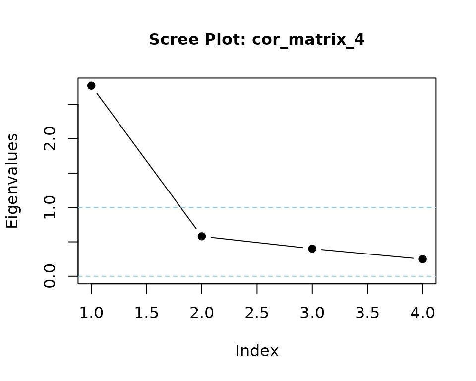
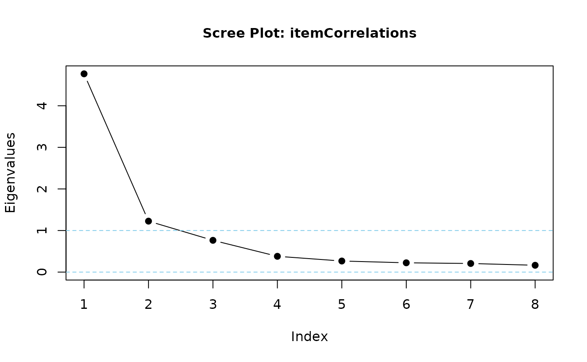
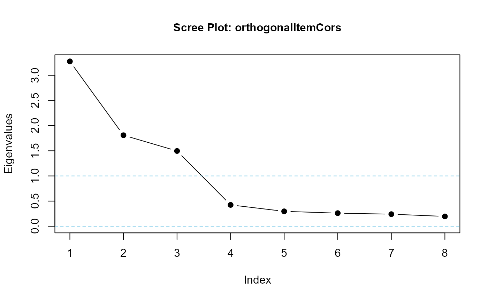
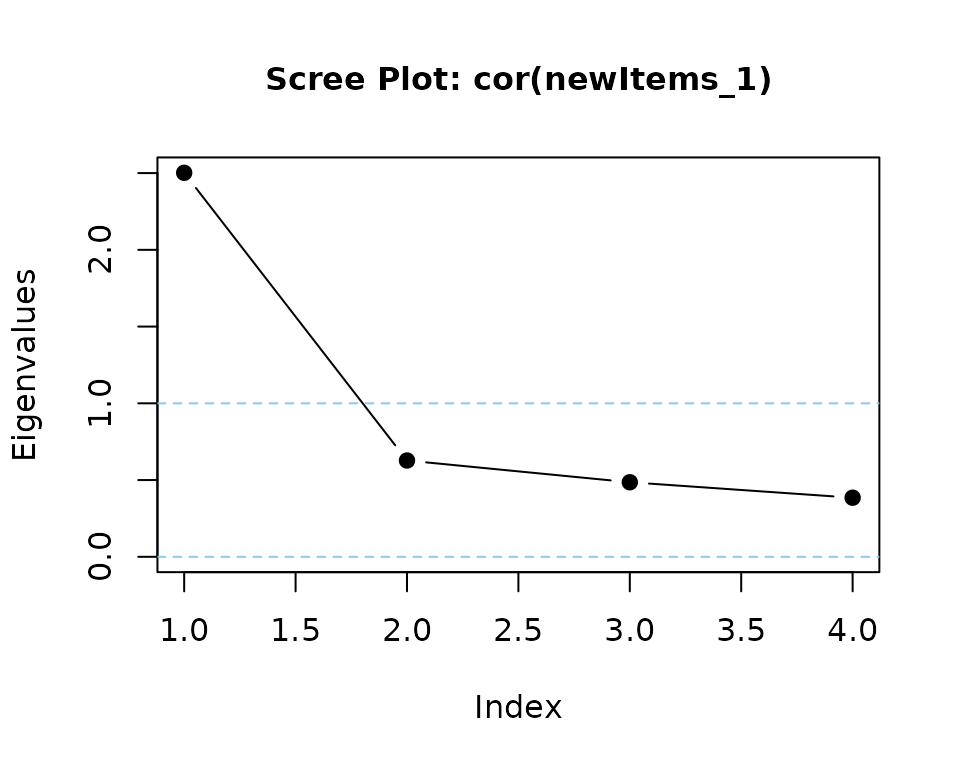
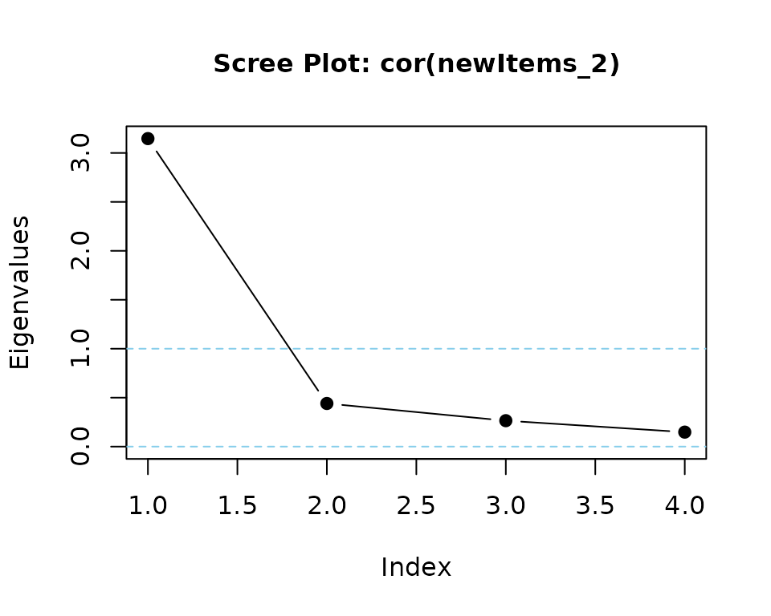
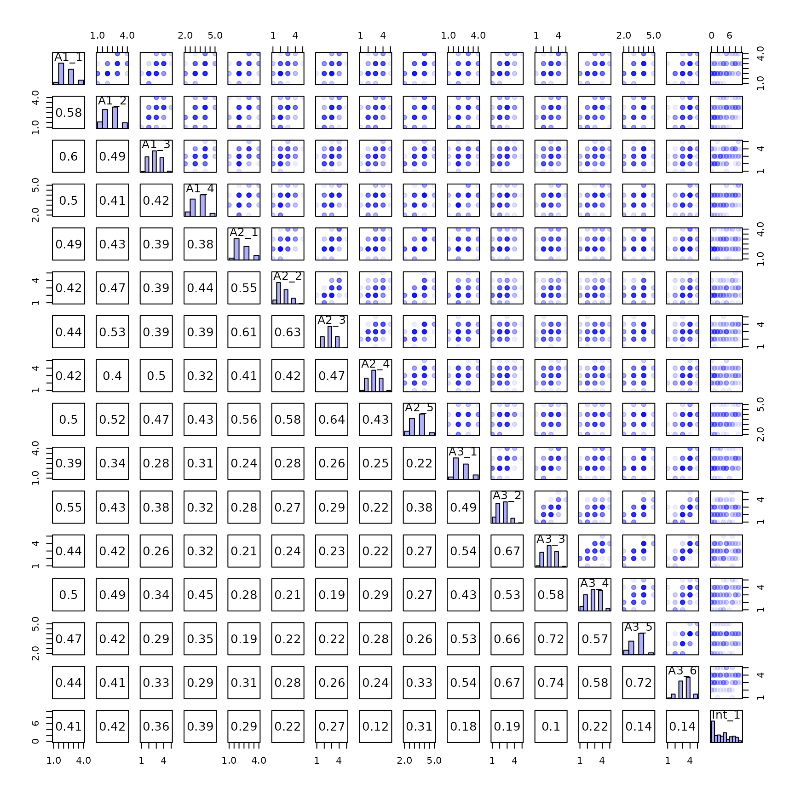
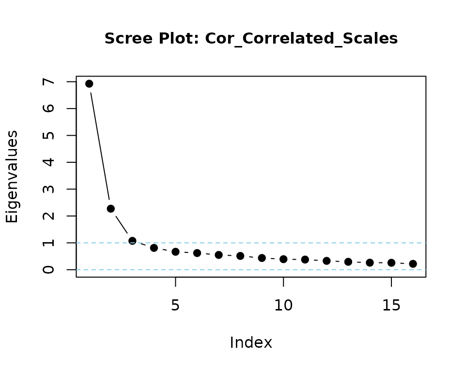
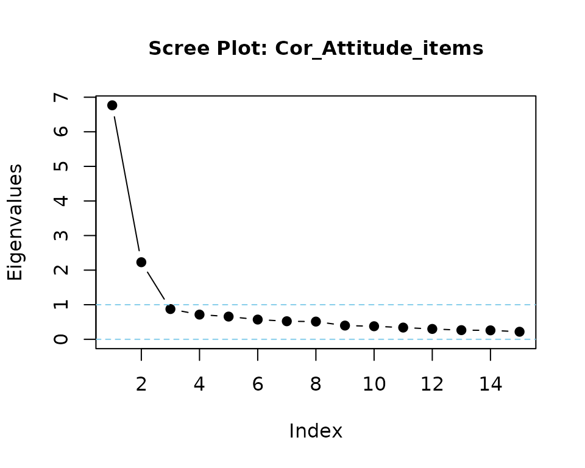
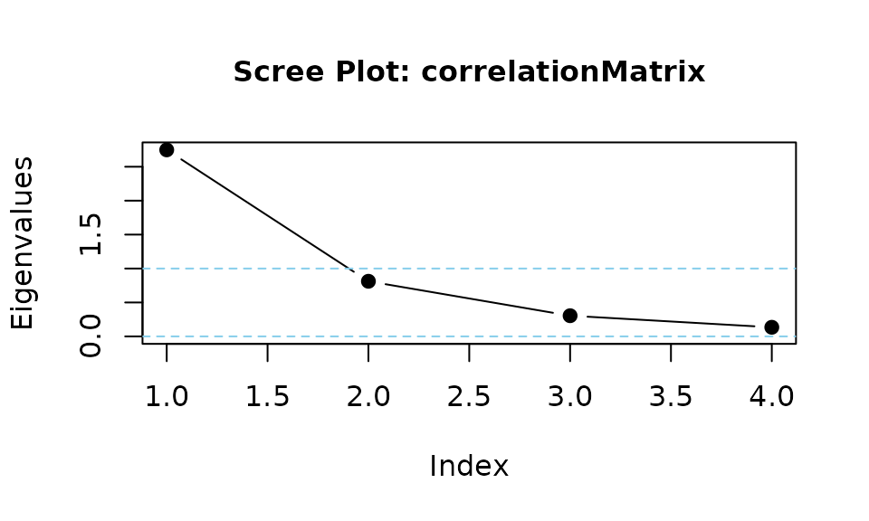

# LikertMakeR vignette


***LikertMakeR*** [(Winzar,
2025)](https://cran.r-project.org/package=LikertMakeR) lets you create
synthetic Likert-scale, or related rating-scale, data.  
Set the mean, standard deviation, and correlations or model
coefficients, and the package generates data matching those properties.
It can also rearrange existing data columns to achieve a desired
correlation structure or generate data based on *Cronbach’s Alpha*,
*factor correlations*, *regression* or *ANOVA coefficients*, or other
summary statistics.

### Purpose

The package should be useful for teaching in the Social Sciences, and
for scholars who wish to “replicate” or “reverse engineer” rating-scale
data for further analysis and visualisation when only summary statistics
have been reported.

### Motivation

I was prompted to write the core functions in *LikertMakeR* after
reviewing too many journal article submissions where authors presented
questionnaire results with only means and standard deviations (often
only the means), with no apparent understanding of scale distributions,
and their impact on scale properties.

Hopefully, this tool will help researchers, teachers & students, and
other reviewers, to better think about rating-scale distributions, and
the effects of covariation, scale boundaries, and number of items in a
scale. Researchers can also use *LikertMakeR* to create dummy data to
prepare analyses ahead of a formal survey.

### Rating scale properties

A *Likert* scale is the mean, or sum, of several ordinal rating scales.
Typically, they are bipolar (usually “agree-disagree”) responses to
propositions that are determined to be moderately-to-highly correlated
and that capture some facet of a theoretical construct.

#### Rating scales have bounds and discrete measurement intervals

Rating scales, such as *Likert* scales, are not continuous or unbounded.

For example, a 5-point Likert scale that is constructed with, say, five
items (questions) will have a summed range of between 5 (all rated ‘1’)
and 25 (all rated ‘5’) with all integers in between, and the mean range
will be ‘1’ to ‘5’ with intervals of 1/5=0.20. A 7-point Likert scale
constructed from eight items will have a summed range between 8 (all
rated ‘1’) and 56 (all rated ‘7’) with all integers in between, and the
mean range will be ‘1’ to ‘7’ with intervals of 1/8=0.125.

Technically, because they are bounded and not continuous, parametric
statistics, such as mean, standard deviation, and correlation, should
not be applied to summated rating scales. In practice, however,
parametric statistics are commonly used in the social sciences because:

1.  they are in common usage and easily understood,

2.  In practice, all measures are bounded by the constraints of the
    measurement tool, meaning that they also have upper and lower
    boundaries and discrete units of measurement, which means that:

3.  results and conclusions drawn from technically-correct
    non-parametric statistics are *(almost)* always the same as for
    parametric statistics for such data.  
    For example, [D’Alessandro *et al.*
    (2020)](https://cengage.com.au/sem121/marketing-research-5th-edition-dalessandro-babin-zikmund)
    argue that a summated scale, made with multiple items, “approaches”
    an interval scale measure, implying that parametric statistics are
    quite acceptable.

#### A single 1-5 rating scale is ***NOT*** a Likert scale - it may be an Likert-scale item.

Likert-scale items, such as responses to a single 1-to-5 agree-disagree
question, should not be analysed by professional or responsible
researchers. There is too much random error in a single item. [Rensis
Likert (1932)](https://archive.org/details/likert-1932/mode/2up)
designed the scale with the logic that a random overstatement on one
item is likely to be compensated by a random understatement on another
item, so that, when multiple items are combined, we get a reasonably
consistent, internally reliable, measure of the target construct.

#### Most rating scales are skewed

Rating-scale boundaries define minima and maxima for any scale values.
If the mean is close to one boundary then data points will gather more
closely to that boundary.  
If the mean is not in the middle of a scale, then the data will be
always skewed, as shown in the following plots.


Off-centre means always give skewed distribution in bounded rating
scales

------------------------------------------------------------------------

### *LikertMakeR* functions

- *lfast()* generate a vector of values with predefined mean and
  standard deviation.

- *lcor()* takes a dataframe of rating-scale values and rearranges the
  values in each column so that the columns are correlated to match a
  predefined correlation matrix.

- *makeCorrAlpha* constructs a random correlation matrix of given
  dimensions from a predefined *Cronbach’s Alpha*.

- *makeCorrLoadings* constructs a random correlation matrix from a given
  *factor loadings* matrix, and *factor-correlations* matrix.

- *makeScales()* is a wrapper function for *lfast()* and *lcor()* to
  generate items or summated scales with predefined first and second
  moments and a predefined correlation matrix. This function replaces
  *makeItems()* and now includes multi-item measures.

- *makeItemsScale()* generates a random dataframe of scale items based
  on a predefined summated scale with a desired Cronbach’s Alpha.

- *makePaired()* generates a dataframe of two correlated columns based
  on summary data from a paired-sample t-test.

- *makeRepeated()* generates a dataframe of `k` correlated columns based
  on summary data from a repeated-samples ANOVA.

- *makeScalesRegression()* generates a dataframe based on results of
  output from multiple-regression - R², standardised betas, and IV
  correlations (if available).

- *correlateScales()* creates a dataframe of correlated summated scales
  as one might find in completed survey questionnaire and possibly used
  in a Structural Equation model.

- Helper Functions

  - *alpha()* calculates Cronbach’s Alpha from a given correlation
    matrix or a given dataframe.

  - *eigenvalues()* calculates eigenvalues of a correlation matrix,
    reports on positive-definite status of the matrix and, optionally,
    displays a scree plot to visualise the eigenvalues.

  - *reliability()* Computes internal consistency reliability estimates
    for a single-factor scale, including Cronbach’s alpha, McDonald’s
    omega (total), and optional ordinal (polychoric-based) variants and
    Confidence intervals

------------------------------------------------------------------------

## Using *LikertMakeR*

### Download and Install *LikertMakeR*

#### from *CRAN*

    > ```
    >
    > install.packages("LikertMakeR")
    > library(LikertMakeR)
    >
    > ```

#### development version from *GitHub*.

    > ```
    > 
    > library(devtools)
    > install_github("WinzarH/LikertMakeR")
    > library(LikertMakeR)
    >
    > ```

------------------------------------------------------------------------

### Generate synthetic rating-scale data

#### *lfast()*

- ***lfast()*** applies a simple evolutionary algorithm which draws
  repeated random samples from a scaled *Beta* distribution. It produces
  a vector of values with mean and standard deviation typically correct
  to two decimal places.

To synthesise a rating scale with ***lfast()***, the user must input the
following parameters:

- ***n***: sample size

- ***mean***: desired mean

- ***sd***: desired standard deviation

- ***lowerbound***: desired lower bound

- ***upperbound***: desired upper bound

- ***items***: number of items making the scale - default = 1

An earlier version of *LikertMakeR* had a function, *lexact()*, which
was slow and no more accurate than the latest version of *lfast()*. So,
*lexact()* is now deprecated.

##### *lfast()* example

###### a four-item, five-point Likert scale

``` r
nItems <- 4
mean <- 2.5
sd <- 0.75

x1 <- lfast(
  n = 512,
  mean = mean,
  sd = sd,
  lowerbound = 1,
  upperbound = 5,
  items = nItems
)
#> best solution in 256 iterations
```


Example: 4-item, 1-5 Likert scale

###### an 11-point likelihood-of-purchase scale

###### *lfast()*

``` r
x2 <- lfast(256, 3, 2.5, 0, 10)
#> best solution in 7723 iterations
```


Example: likelihood-of-purchase scale

------------------------------------------------------------------------

### Correlating rating scales

The function, ***lcor()***, rearranges the values in the columns of a
data-set so that they are correlated at a specified level. It does not
change the values - it swaps their positions within each column so that
univariate statistics do not change, but their correlations with other
vectors do.

#### *lcor()*

***lcor()*** systematically selects pairs of values in a column and
swaps their places, and checks to see if this swap improves the
correlation matrix. If the revised dataframe produces a correlation
matrix closer to the target correlation matrix, then the swap is
retained. Otherwise, the values are returned to their original places.
This process is iterated across each column.

To create the desired correlated data, the user must define the
following parameters:

- ***data***: a starter data set of rating-scales. Number of columns
  must match the dimensions of the *target* correlation matrix.

- ***target***: the target correlation matrix.

#### *lcor()* example

Let’s generate some data: three 5-point Likert scales, each with five
items.

``` r
## generate uncorrelated synthetic data
n <- 128
lowerbound <- 1
upperbound <- 5
items <- 5

mydat3 <- data.frame(
  x1 = lfast(n, 2.5, 0.75, lowerbound, upperbound, items),
  x2 = lfast(n, 3.0, 1.50, lowerbound, upperbound, items),
  x3 = lfast(n, 3.5, 1.00, lowerbound, upperbound, items)
)
#> best solution in 812 iterations
#> best solution in 7553 iterations
#> best solution in 385 iterations
```

The first six observations from this dataframe are:

    #>    x1  x2  x3
    #> 1 1.4 1.0 5.0
    #> 2 2.8 5.0 4.2
    #> 3 3.4 1.8 2.0
    #> 4 2.0 4.8 4.4
    #> 5 3.6 1.0 3.4
    #> 6 2.2 2.8 4.0

And the first and second moments (to 3 decimal places) are:

    #>         x1    x2    x3
    #> mean 2.500 3.002 3.498
    #> sd   0.752 1.501 1.001

We can see that the data have first and second moments are very close to
what is expected.

As we should expect, randomly-generated synthetic data have low
correlations:

    #>       x1    x2   x3
    #> x1  1.00 -0.02 0.03
    #> x2 -0.02  1.00 0.00
    #> x3  0.03  0.00 1.00

Now, let’s define a target correlation matrix:

``` r
## describe a target correlation matrix
tgt3 <- matrix(
  c(
    1.00, 0.85, 0.75,
    0.85, 1.00, 0.65,
    0.75, 0.65, 1.00
  ),
  nrow = 3
)
```

So now we have a dataframe with desired first and second moments, and a
target correlation matrix.

``` r
## apply lcor() function
new3 <- lcor(data = mydat3, target = tgt3)
```

Values in each column of the new dataframe do not change from the
original; the values are rearranged.

The first ten observations from this dataframe are:

    #>     X1  X2  X3
    #> 1  2.6 4.4 3.6
    #> 2  2.8 4.2 2.2
    #> 3  2.0 1.8 4.2
    #> 4  2.2 1.8 3.4
    #> 5  1.6 1.2 2.2
    #> 6  2.2 2.4 2.4
    #> 7  2.4 1.0 4.2
    #> 8  3.2 5.0 5.0
    #> 9  1.8 1.2 1.6
    #> 10 2.4 1.6 4.2

And the new dataframe is correlated close to our desired correlation
matrix; here presented to 3 decimal places:

    #>      X1   X2   X3
    #> X1 1.00 0.85 0.75
    #> X2 0.85 1.00 0.65
    #> X3 0.75 0.65 1.00

------------------------------------------------------------------------

### Generate a correlation matrix from Cronbach’s Alpha

#### makeCorrAlpha()

***makeCorrAlpha()***, constructs a random correlation matrix of given
dimensions and predefined *Cronbach’s alpha*.

To create the desired correlation matrix, the user must define the
following parameters:

- ***items***: or “k” - the number of rows and columns of the desired
  correlation matrix.

- ***alpha***: the target value for Cronbach’s Alpha

- ***variance***: a notional variance coefficient to affect the spread
  of values in the correlation matrix. Default = ‘0.1’. A value of ‘0’
  produces a matrix where all off-diagonal correlations are equal.
  Setting ‘variance = 0.25’ or more may be infeasible, so the function
  should gracefully adjust the `variance` parameter downwards to achieve
  PD status.

- ***alpha_noise***: Controls random variation in the target Cronbach’s
  alpha before the correlation matrix is constructed.

When `alpha_noise = 0` (default), the requested alpha is reproduced
deterministically (subject to numerical tolerance).

When `alpha_noise > 0`, a small amount of random variation is added to
the requested alpha prior to constructing the matrix. This can be useful
in teaching or simulation settings where slightly different reliability
values are desired across repeated runs.

Internally, noise is added on the Fisher *z*-transformed scale to ensure
the resulting alpha remains within valid bounds (0, 1).

Typical guidance:

- 0.00 — deterministic alpha (default)
- 0.02 — very small variation
- 0.05 — moderate variation
- 0.10 — substantial variation (caution)

Larger values increase the spread of achieved alpha across runs.

- ***diagnostics***: Logical. If `TRUE`, returns a list containing the
  correlation matrix and a diagnostics list (target/achieved alpha,
  average inter-item correlation, eigenvalues, PD flag, and key
  arguments). If `FALSE` (default), returns the correlation matrix only.

##### *makeCorrAlpha()* examples

###### Four variables, alpha = 0.85

``` r
## define parameters
items <- 4
alpha <- 0.85

## apply makeCorrAlpha() function
set.seed(42)

cor_matrix_4 <- makeCorrAlpha(items, alpha)
```

*makeCorrAlpha()* produced the following correlation matrix (to three
decimal places):

    #>        item01 item02 item03 item04
    #> item01  1.000  0.565  0.667  0.697
    #> item02  0.565  1.000  0.484  0.506
    #> item03  0.667  0.484  1.000  0.598
    #> item04  0.697  0.506  0.598  1.000

###### test output with Helper functions

``` r
## using helper function alpha()

alpha(cor_matrix_4)
#> [1] 0.8499981
```

``` r
## using helper function eigenvalues()

eigenvalues(cor_matrix_4, 1)
```



    #> cor_matrix_4  is positive-definite
    #> [1] 2.7665013 0.5480310 0.4036204 0.2818473

##### makeCorrAlpha() with diagnostics output

``` r
## apply makeCorrAlpha() with diagnostics
set.seed(42)

cor_matrix_5 <- makeCorrAlpha(
  items = 6,
  alpha = 0.90,
  diagnostics = TRUE
)
```

###### diagnostics output

``` r
## output
cor_matrix_5$R |> round(2)
#>        item01 item02 item03 item04 item05 item06
#> item01   1.00   0.59   0.72   0.76   0.73   0.66
#> item02   0.59   1.00   0.50   0.52   0.50   0.45
#> item03   0.72   0.50   1.00   0.64   0.61   0.55
#> item04   0.76   0.52   0.64   1.00   0.64   0.58
#> item05   0.73   0.50   0.61   0.64   1.00   0.55
#> item06   0.66   0.45   0.55   0.58   0.55   1.00

cor_matrix_5$diagnostics
#> $items
#> [1] 6
#> 
#> $alpha_input
#> [1] 0.9
#> 
#> $alpha_target_effective
#> [1] 0.9
#> 
#> $alpha_achieved
#> [1] 0.8999999
#> 
#> $average_r
#> [1] 0.5999997
#> 
#> $min_eigenvalue
#> [1] 0.192857
#> 
#> $variance_input
#> [1] 0.1
#> 
#> $internal_variance_used
#> [1] 0.1
#> 
#> $alpha_noise
#> [1] 0
```

------------------------------------------------------------------------

### Generate a correlation matrix from factor loadings

#### makeCorrLoadings

***makeCorrLoadings()*** generates a correlation matrix from factor
loadings and factor correlations as might be seen in *Exploratory Factor
Analysis* (**EFA**) or a *Structural Equation Model* (**SEM**).

##### makeCorrLoadings() usage

      makeCorrLoadings(loadings, factorCor = NULL, uniquenesses = NULL, nearPD = FALSE)

###### makeCorrLoadings() arguments

- ***loadings***: `k` (items) by `f` (factors) matrix of *standardised*
  factor loadings. Item names and Factor names can be taken from the
  row_names (items) and the column_names (factors), if present.

- ***factorCor***: `f` x `f` factor correlation matrix. If not present,
  then we assume that the factors are uncorrelated (orthogonal), which
  is rare in practice, and the function applies an identity matrix for
  *factor_cor*.

- ***uniquenesses***: length `k` vector of uniquenesses. If NULL, the
  default, compute from the calculated communalities.

- ***nearPD***: (logical) If TRUE, then the function calls the *nearPD*
  function from the ***Matrix*** package to transform the resulting
  correlation matrix onto the nearest Positive Definite matrix.
  Obviously, this only applies if the resulting correlation matrix is
  not positive definite. (*It should never be needed.*)

###### Note

“Censored” loadings (for example, where loadings less than some small
value (often ‘0.30’), are removed for ease-of-communication) tend to
severely reduce the accuracy of the
[`makeCorrLoadings()`](https://winzarh.github.io/LikertMakeR/reference/makeCorrLoadings.md)
function. For a detailed demonstration, see the vignette file,
**makeCorrLoadings_Validate**.

#### makeCorrLoadings() examples

##### Typical application from published EFA results

###### define parameters

``` r
## Example loadings

factorLoadings <- matrix(
  c(
    0.05, 0.20, 0.70,
    0.10, 0.05, 0.80,
    0.05, 0.15, 0.85,
    0.20, 0.85, 0.15,
    0.05, 0.85, 0.10,
    0.10, 0.90, 0.05,
    0.90, 0.15, 0.05,
    0.80, 0.10, 0.10
  ),
  nrow = 8, ncol = 3, byrow = TRUE
)

## row and column names

rownames(factorLoadings) <- c("Q1", "Q2", "Q3", "Q4", "Q5", "Q6", "Q7", "Q8")
colnames(factorLoadings) <- c("Factor1", "Factor2", "Factor3")

## Factor correlation matrix**

factorCor <- matrix(
  c(
    1.0,  0.5, 0.4,
    0.5,  1.0, 0.3,
    0.4,  0.3, 1.0
  ),
  nrow = 3, byrow = TRUE
)
```

###### Apply the function

``` r
## apply makeCorrLoadings() function
itemCorrelations <- makeCorrLoadings(factorLoadings, factorCor)

## derived correlation matrix to two decimal places
round(itemCorrelations, 2)
#>      Q1   Q2   Q3   Q4   Q5   Q6   Q7   Q8
#> Q1 1.00 0.62 0.67 0.48 0.42 0.42 0.43 0.41
#> Q2 0.62 1.00 0.72 0.43 0.36 0.36 0.44 0.42
#> Q3 0.67 0.72 1.00 0.50 0.43 0.43 0.46 0.45
#> Q4 0.48 0.43 0.50 1.00 0.79 0.83 0.65 0.58
#> Q5 0.42 0.36 0.43 0.79 1.00 0.80 0.54 0.48
#> Q6 0.42 0.36 0.43 0.83 0.80 1.00 0.59 0.52
#> Q7 0.43 0.44 0.46 0.65 0.54 0.59 1.00 0.78
#> Q8 0.41 0.42 0.45 0.58 0.48 0.52 0.78 1.00
```

###### Test makeCorrLoadings() output

``` r
## correlated factors mean that eigenvalues should suggest two or three factors
eigenvalues(cormatrix = itemCorrelations, scree = TRUE)
```



    #> itemCorrelations  is positive-definite
    #> [1] 4.7679427 1.2254239 0.7641967 0.3799863 0.2668158 0.2237851 0.2073574
    #> [8] 0.1644922

###### Assuming orthogonal factors

``` r
## orthogonal factors are assumed when factor correlation matrix is not included
orthogonalItemCors <- makeCorrLoadings(factorLoadings)

## derived correlation matrix to two decimal places
round(orthogonalItemCors, 2)
#>      Q1   Q2   Q3   Q4   Q5   Q6   Q7   Q8
#> Q1 1.00 0.58 0.63 0.28 0.24 0.22 0.11 0.13
#> Q2 0.58 1.00 0.69 0.18 0.13 0.10 0.14 0.17
#> Q3 0.63 0.69 1.00 0.26 0.22 0.18 0.11 0.14
#> Q4 0.28 0.18 0.26 1.00 0.75 0.79 0.32 0.26
#> Q5 0.24 0.13 0.22 0.75 1.00 0.78 0.18 0.14
#> Q6 0.22 0.10 0.18 0.79 0.78 1.00 0.23 0.18
#> Q7 0.11 0.14 0.11 0.32 0.18 0.23 1.00 0.74
#> Q8 0.13 0.17 0.14 0.26 0.14 0.18 0.74 1.00
```

###### Test orthogonal output

``` r
## eigenvalues should suggest exactly  three factors
eigenvalues(cormatrix = orthogonalItemCors, scree = TRUE)
```



    #> orthogonalItemCors  is positive-definite
    #> [1] 3.2769426 1.8091128 1.4966064 0.4244753 0.2966222 0.2605233 0.2402622
    #> [8] 0.1954553

------------------------------------------------------------------------

### Generate a dataframe of rating scales from a correlation matrix and predefined moments

#### makeScales()

***makeScales()*** generates a dataframe of random discrete values so
the data replicate a set of scale items or summated rating scales, and
are correlated close to a predefined correlation matrix.

Generally, means, standard deviations, and correlations are correct to
two decimal places.

*makeScales()* is a wrapper function for

- *lfast()*, which takes repeated samples selecting a vector that best
  fits the desired moments, and

- *lcor()*, which rearranges values in each column of the dataframe so
  they closely match the desired correlation matrix.

To create the desired dataframe, the user must define the following
parameters:

- ***n***: number of observations

- ***dfMeans***: a vector of length `k` of desired means of each
  variable

- ***dfSds***: a vector of length `k` of desired standard deviations of
  each variable

- ***lowerbound***: a vector of length `k` of values for the lower bound
  of each variable. default = ‘1’

- ***upperbound***: a vector of length `k` of values for the upper bound
  of each variable. Default = ‘5’

- ***items***: a vector of length `k` of the number of items in each
  variable. Default = ‘1’.

- ***cormatrix***: a target correlation matrix with `k` rows and `k`
  columns.

#### *makeScales()* examples

##### *makeScales()* example \#1. four correlated items

``` r
## define parameters
n <- 128
dfMeans <- c(2.5, 3.0, 3.0, 3.5)
dfSds <- c(1.0, 1.0, 1.5, 0.75)
lowerbound <- rep(1, 4)
upperbound <- rep(5, 4)

corMat <- matrix(
  c(
    1.00, 0.25, 0.35, 0.45,
    0.25, 1.00, 0.70, 0.75,
    0.35, 0.70, 1.00, 0.85,
    0.45, 0.75, 0.85, 1.00
  ),
  nrow = 4, ncol = 4
)

var_names <- c("var1", "var2", "var3", "var4")
colnames(corMat) <- var_names
rownames(corMat) <- var_names

## apply makeScales() function
df <- makeScales(
  n = n,
  means = dfMeans,
  sds = dfSds,
  lowerbound = lowerbound,
  upperbound = upperbound,
  cormatrix = corMat
)
#> Variable  1 :  var1  -
#> reached maximum of 16384 iterations
#> Variable  2 :  var2  -
#> reached maximum of 16384 iterations
#> Variable  3 :  var3  -
#> best solution in 2246 iterations
#> Variable  4 :  var4  -
#> reached maximum of 16384 iterations
#> 
#> Arranging data to match correlations
#> 
#> Successfully generated correlated variables
```

###### Structure of new dataframe

``` r
## test the function
str(df)
#> 'data.frame':    128 obs. of  4 variables:
#>  $ var1: num  1 4 3 4 3 2 3 2 3 2 ...
#>  $ var2: num  2 4 4 4 3 2 4 2 4 4 ...
#>  $ var3: num  1 3 5 5 2 1 5 3 2 4 ...
#>  $ var4: num  3 4 5 4 3 3 4 4 3 4 ...
```

###### Means should be correct to two decimal places

``` r
### means should be correct to two decimal places
dfmoments <- data.frame(
  mean = apply(df, 2, mean) |> round(3),
  sd = apply(df, 2, sd) |> round(3)
) |> t()

dfmoments
#>       var1  var2  var3  var4
#> mean 2.500 3.000 3.000 3.500
#> sd   1.004 1.004 1.501 0.753
```

###### Correlations should be correct to two decimal places

``` r
### correlations should be correct to two decimal places
cor(df) |> round(3)
#>       var1 var2  var3  var4
#> var1 1.000 0.25 0.350 0.448
#> var2 0.250 1.00 0.700 0.750
#> var3 0.350 0.70 1.000 0.843
#> var4 0.448 0.75 0.843 1.000
```

##### *makeScales()* example \#2. four Likert scales

- **Brand Trust (BT)** - The confidence a consumer has in a brand’s
  reliability and honesty.
- **Brand Satisfaction (BS)** - Overall affective evaluation of the
  brand experience.
- **Brand Love (BL)** - Deep emotional attachment toward the brand.
- **Brand Loyalty (BLY)** - Intention to repurchase and recommend the
  brand.

``` r
## define parameters
n <- 256
dfMeans <- c(3.9, 4.1, 3.6, 4.0)
dfSds <- c(0.6, 0.5, 0.8, 0.7)
lowerbound <- rep(1, 4)
upperbound <- rep(5, 4)
items <- c(4, 3, 4, 3)

corMat <- matrix(
  c(
    1.00, 0.75, 0.60, 0.70,
    0.75, 1.00, 0.65, 0.72,
    0.60, 0.65, 1.00, 0.68,
    0.70, 0.72, 0.68, 1.00
  ),
  nrow = 4, ncol = 4
)

scale_names <- c("BT", "BS", "BL", "BLY")
rownames(corMat) <- scale_names
colnames(corMat) <- scale_names

## apply makeScales() function
df <- makeScales(
  n = n,
  means = dfMeans,
  sds = dfSds,
  lowerbound = lowerbound,
  upperbound = upperbound,
  items = items,
  cormatrix = corMat
)
#> Variable  1 :  BT  -
#> best solution in 754 iterations
#> Variable  2 :  BS  -
#> best solution in 104 iterations
#> Variable  3 :  BL  -
#> best solution in 972 iterations
#> Variable  4 :  BLY  -
#> best solution in 1372 iterations
#> 
#> Arranging data to match correlations
#> 
#> Successfully generated correlated variables

## test the function
head(df)
#>     BT       BS   BL      BLY
#> 1 3.75 4.000000 3.75 4.000000
#> 2 3.75 4.333333 4.00 3.666667
#> 3 4.00 4.000000 3.00 4.000000
#> 4 4.25 4.333333 4.00 4.000000
#> 5 4.50 4.333333 4.00 4.666667
#> 6 4.75 4.666667 3.50 5.000000
tail(df)
#>       BT       BS   BL      BLY
#> 251 4.50 4.666667 4.00 4.666667
#> 252 3.50 3.000000 3.25 3.000000
#> 253 2.50 3.000000 1.75 3.333333
#> 254 2.50 3.000000 1.75 3.333333
#> 255 4.50 4.666667 4.50 5.000000
#> 256 3.75 3.000000 2.50 2.333333

### means should be correct to two decimal places
dfmoments <- data.frame(
  mean = apply(df, 2, mean) |> round(3),
  sd = apply(df, 2, sd) |> round(3)
) |> t()

dfmoments
#>         BT    BS    BL BLY
#> mean 3.901 4.102 3.599 4.0
#> sd   0.600 0.499 0.799 0.7

### correlations should be correct to two decimal places
cor(df) |> round(3)
#>       BT    BS   BL   BLY
#> BT  1.00 0.750 0.60 0.700
#> BS  0.75 1.000 0.65 0.719
#> BL  0.60 0.650 1.00 0.680
#> BLY 0.70 0.719 0.68 1.000
```

------------------------------------------------------------------------

### Generate a dataframe from Cronbach’s Alpha and predefined moments

This is a two-step process:

1.  apply ***makeCorrAlpha()*** to generate a correlation matrix from
    desired alpha,

2.  apply ***makeScales()*** to generate rating-scale items from the
    correlation matrix and desired moments

Required parameters are:

- ***k***: number items/ columns

- ***alpha***: a target Cronbach’s Alpha.

- ***n***: number of observations

- ***lowerbound***: a vector of length `k` of values for the lower bound
  of each variable

- ***upperbound***: a vector of length `k` of values for the upper bound
  of each variable

- ***means***: a vector of length `k` of desired means of each variable

- ***sds***: a vector of length `k` of desired standard deviations of
  each variable

#### Step 1: Generate a correlation matrix

``` r
## define parameters
k <- 6
myAlpha <- 0.85

## generate correlation matrix
set.seed(42)
myCorr <- makeCorrAlpha(items = k, alpha = myAlpha)

## display correlation matrix
myCorr |> round(3)
#>        item01 item02 item03 item04 item05 item06
#> item01  1.000  0.477  0.597  0.632  0.603  0.536
#> item02  0.477  1.000  0.392  0.414  0.395  0.352
#> item03  0.597  0.392  1.000  0.519  0.495  0.440
#> item04  0.632  0.414  0.519  1.000  0.523  0.466
#> item05  0.603  0.395  0.495  0.523  1.000  0.444
#> item06  0.536  0.352  0.440  0.466  0.444  1.000

### checking Cronbach's Alpha
alpha(cormatrix = myCorr)
#> [1] 0.8499932
```

#### Step 2: Generate dataframe

``` r
## define parameters
n <- 256
myMeans <- c(2.75, 3.00, 3.00, 3.25, 3.50, 3.5)
mySds <- c(1.00, 0.75, 1.00, 1.00, 1.00, 1.5)
lowerbound <- rep(1, k)
upperbound <- rep(5, k)

## Generate Items
myItems <- makeScales(
  n = n, means = myMeans, sds = mySds,
  lowerbound = lowerbound, upperbound = upperbound,
  items = 1,
  cormatrix = myCorr
)
#> Variable  1 :  item01  -
#> best solution in 288 iterations
#> Variable  2 :  item02  -
#> best solution in 2220 iterations
#> Variable  3 :  item03  -
#> best solution in 1058 iterations
#> Variable  4 :  item04  -
#> best solution in 2125 iterations
#> Variable  5 :  item05  -
#> best solution in 452 iterations
#> Variable  6 :  item06  -
#> best solution in 12575 iterations
#> 
#> Arranging data to match correlations
#> 
#> Successfully generated correlated variables

## resulting dataframe
head(myItems)
#>   item01 item02 item03 item04 item05 item06
#> 1      4      3      4      5      5      4
#> 2      5      3      3      4      5      4
#> 3      2      4      2      2      3      4
#> 4      4      4      5      4      4      5
#> 5      3      3      2      3      3      2
#> 6      1      2      1      3      2      3
tail(myItems)
#>     item01 item02 item03 item04 item05 item06
#> 251      3      4      4      5      5      5
#> 252      2      4      4      3      3      4
#> 253      4      3      3      4      5      5
#> 254      2      3      3      4      3      3
#> 255      2      2      3      3      4      5
#> 256      3      3      3      3      3      5

## means and standard deviations
myMoments <- data.frame(
  means = apply(myItems, 2, mean) |> round(3),
  sds = apply(myItems, 2, sd) |> round(3)
) |> t()
myMoments
#>       item01 item02 item03 item04 item05 item06
#> means  2.750  3.000  3.000  3.250  3.500  3.500
#> sds    0.998  0.751  0.998  0.998  1.002  1.498

## Cronbach's Alpha of dataframe
alpha(NULL, myItems)
#> [1] 0.8500638
```

##### Summary plots of new dataframe


Summary of dataframe from makeScales() function

------------------------------------------------------------------------

### Generate a dataframe of rating-scale items from a summated rating scale

#### makeItemsScale()

- ***makeItemsScale()*** generates a dataframe of rating-scale items
  from a summated rating scale and desired *Cronbach’s Alpha*.

To create the desired dataframe, define the following parameters:

- ***scale***: a vector or dataframe of the summated rating scale.
  Should range from (‘lowerbound’ \* ‘items’) to (‘upperbound’ \*
  ‘items’)

- ***lowerbound***: lower bound of the scale item (example: ‘1’ in a ‘1’
  to ‘5’ rating)

- ***upperbound***: upper bound of the scale item (example: ‘5’ in a ‘1’
  to ‘5’ rating)

- ***items***: k, or number of columns to generate

- ***alpha***: desired Cronbach’s Alpha. Default = ‘0.8’

- ***summated***: (logical) If TRUE, the scale is treated as a summed
  score (e.g., 4–20 for four 5-point items). If FALSE, it is treated as
  an averaged score (e.g., 1–5 in 0.25 increments). Default = TRUE.

- ***progress***: (logical) If TRUE (default is
  [`interactive()`](https://rdrr.io/r/base/interactive.html)), a
  progress bar is displayed during optimisation. Set to FALSE for
  slightly faster execution.

##### *makeItemsScale()* Example:

##### create items with *makeItemsScale()*

``` r

summatedScale <- c(11, 8, 14, 12, 9, 12, 10, 9, 8, 18, 16, 16, 14, 8, 15, 12)

## apply makeItemsScale() function

newItems <- makeItemsScale(
  scale = summatedScale,
  lowerbound = 1,
  upperbound = 5,
  items = 4
)
#> generate 16 rows
#> rearrange 4 values within each of 16 rows
#>   |                                                                              |                                                                      |   0%  |                                                                              |                                                                      |   1%  |                                                                              |=                                                                     |   1%  |                                                                              |=                                                                     |   2%  |                                                                              |==                                                                    |   2%  |                                                                              |==                                                                    |   3%  |                                                                              |==                                                                    |   4%  |                                                                              |===                                                                   |   4%  |                                                                              |===                                                                   |   5%  |                                                                              |====                                                                  |   5%  |                                                                              |====                                                                  |   6%  |                                                                              |=====                                                                 |   6%  |                                                                              |=====                                                                 |   7%  |                                                                              |=====                                                                 |   8%  |                                                                              |======                                                                |   8%  |                                                                              |======                                                                |   9%  |                                                                              |=======                                                               |   9%  |                                                                              |=======                                                               |  10%  |                                                                              |=======                                                               |  11%  |                                                                              |========                                                              |  11%  |                                                                              |========                                                              |  12%  |                                                                              |=========                                                             |  12%  |                                                                              |=========                                                             |  13%  |                                                                              |==========                                                            |  14%  |                                                                              |==========                                                            |  15%  |                                                                              |===========                                                           |  15%  |                                                                              |===========                                                           |  16%  |                                                                              |============                                                          |  17%  |                                                                              |============                                                          |  18%  |                                                                              |=============                                                         |  18%  |                                                                              |=============                                                         |  19%  |                                                                              |==============                                                        |  19%  |                                                                              |==============                                                        |  20%  |                                                                              |==============                                                        |  21%  |                                                                              |===============                                                       |  21%  |                                                                              |===============                                                       |  22%  |                                                                              |================                                                      |  22%  |                                                                              |================                                                      |  23%  |                                                                              |=================                                                     |  24%  |                                                                              |=================                                                     |  25%  |                                                                              |==================                                                    |  25%  |                                                                              |==================                                                    |  26%  |                                                                              |===================                                                   |  27%  |                                                                              |===================                                                   |  28%  |                                                                              |====================                                                  |  28%  |                                                                              |====================                                                  |  29%  |                                                                              |=====================                                                 |  29%  |                                                                              |=====================                                                 |  30%  |                                                                              |=====================                                                 |  31%  |                                                                              |======================                                                |  31%  |                                                                              |======================                                                |  32%  |                                                                              |=======================                                               |  32%  |                                                                              |=======================                                               |  33%  |                                                                              |========================                                              |  34%  |                                                                              |========================                                              |  35%  |                                                                              |=========================                                             |  35%  |                                                                              |=========================                                             |  36%  |                                                                              |==========================                                            |  37%  |                                                                              |==========================                                            |  38%  |                                                                              |===========================                                           |  38%  |                                                                              |===========================                                           |  39%  |                                                                              |============================                                          |  39%  |                                                                              |============================                                          |  40%  |                                                                              |============================                                          |  41%  |                                                                              |=============================                                         |  41%  |                                                                              |=============================                                         |  42%  |                                                                              |==============================                                        |  42%  |                                                                              |==============================                                        |  43%  |                                                                              |==============================                                        |  44%  |                                                                              |===============================                                       |  44%  |                                                                              |===============================                                       |  45%  |                                                                              |================================                                      |  45%  |                                                                              |================================                                      |  46%  |                                                                              |=================================                                     |  46%  |                                                                              |=================================                                     |  47%  |                                                                              |=================================                                     |  48%  |                                                                              |==================================                                    |  48%  |                                                                              |==================================                                    |  49%  |                                                                              |===================================                                   |  49%  |                                                                              |===================================                                   |  50%  |                                                                              |===================================                                   |  51%  |                                                                              |====================================                                  |  51%  |                                                                              |====================================                                  |  52%  |                                                                              |=====================================                                 |  52%  |                                                                              |=====================================                                 |  53%  |                                                                              |=====================================                                 |  54%  |                                                                              |======================================                                |  54%  |                                                                              |======================================                                |  55%  |                                                                              |=======================================                               |  55%  |                                                                              |=======================================                               |  56%  |                                                                              |========================================                              |  56%  |                                                                              |========================================                              |  57%  |                                                                              |========================================                              |  58%  |                                                                              |=========================================                             |  58%  |                                                                              |=========================================                             |  59%  |                                                                              |==========================================                            |  59%  |                                                                              |==========================================                            |  60%  |                                                                              |==========================================                            |  61%  |                                                                              |===========================================                           |  61%  |                                                                              |===========================================                           |  62%  |                                                                              |============================================                          |  62%  |                                                                              |============================================                          |  63%  |                                                                              |=============================================                         |  64%  |                                                                              |=============================================                         |  65%  |                                                                              |==============================================                        |  65%  |                                                                              |==============================================                        |  66%  |                                                                              |===============================================                       |  67%  |                                                                              |===============================================                       |  68%  |                                                                              |================================================                      |  68%  |                                                                              |================================================                      |  69%  |                                                                              |=================================================                     |  69%  |                                                                              |=================================================                     |  70%  |                                                                              |=================================================                     |  71%  |                                                                              |==================================================                    |  71%  |                                                                              |==================================================                    |  72%  |                                                                              |===================================================                   |  72%  |                                                                              |===================================================                   |  73%  |                                                                              |====================================================                  |  74%  |                                                                              |====================================================                  |  75%  |                                                                              |=====================================================                 |  75%  |                                                                              |=====================================================                 |  76%  |                                                                              |======================================================                |  77%  |                                                                              |======================================================                |  78%  |                                                                              |=======================================================               |  78%  |                                                                              |=======================================================               |  79%  |                                                                              |========================================================              |  79%  |                                                                              |========================================================              |  80%  |                                                                              |========================================================              |  81%  |                                                                              |=========================================================             |  81%  |                                                                              |=========================================================             |  82%  |                                                                              |==========================================================            |  82%  |                                                                              |==========================================================            |  83%  |                                                                              |===========================================================           |  84%  |                                                                              |===========================================================           |  85%  |                                                                              |============================================================          |  85%  |                                                                              |============================================================          |  86%  |                                                                              |=============================================================         |  87%  |                                                                              |=============================================================         |  88%  |                                                                              |==============================================================        |  88%  |                                                                              |==============================================================        |  89%  |                                                                              |===============================================================       |  89%  |                                                                              |===============================================================       |  90%  |                                                                              |===============================================================       |  91%  |                                                                              |================================================================      |  91%  |                                                                              |================================================================      |  92%  |                                                                              |=================================================================     |  92%  |                                                                              |=================================================================     |  93%  |                                                                              |=================================================================     |  94%  |                                                                              |==================================================================    |  94%  |                                                                              |==================================================================    |  95%  |                                                                              |===================================================================   |  95%  |                                                                              |===================================================================   |  96%  |                                                                              |====================================================================  |  96%  |                                                                              |====================================================================  |  97%  |                                                                              |====================================================================  |  98%  |                                                                              |===================================================================== |  98%  |                                                                              |===================================================================== |  99%  |                                                                              |======================================================================|  99%  |                                                                              |======================================================================| 100%
#> reached maximum of 512 iterations
#> Complete!
#> desired Cronbach's alpha = 0.8 (achieved alpha = 0.8002)

###  observations and summated scale
head(cbind(newItems, summatedScale), 16)
#>    X1 X2 X3 X4 summatedScale
#> 1   2  4  3  2            11
#> 2   2  2  2  2             8
#> 3   4  3  4  3            14
#> 4   3  3  3  3            12
#> 5   4  2  2  1             9
#> 6   4  2  3  3            12
#> 7   2  2  3  3            10
#> 8   3  2  1  3             9
#> 9   1  3  2  2             8
#> 10  4  4  5  5            18
#> 11  3  5  4  4            16
#> 12  4  4  4  4            16
#> 13  3  4  4  3            14
#> 14  2  2  2  2             8
#> 15  4  3  3  5            15
#> 16  3  3  3  3            12

### correlation matrix
cor(newItems) |> round(2)
#>      X1   X2   X3   X4
#> X1 1.00 0.14 0.47 0.50
#> X2 0.14 1.00 0.73 0.50
#> X3 0.47 0.73 1.00 0.65
#> X4 0.50 0.50 0.65 1.00

### default Cronbach's alpha = 0.80
alpha(data = newItems) |> round(4)
#> [1] 0.8002

### calculate eigenvalues and print scree plot
eigenvalues(cor(newItems), 1) |> round(3)
```



    #> cor(newItems)  is positive-definite
    #> [1] 2.538 0.889 0.385 0.188

##### *makeItemsScale()* with same summated values and higher *alpha*

``` r
## apply makeItemsScale() function
newItems_2 <- makeItemsScale(
  scale = summatedScale,
  lowerbound = 1,
  upperbound = 5,
  items = 4,
  alpha = 0.9
)
#> generate 16 rows
#> rearrange 4 values within each of 16 rows
#>   |                                                                              |                                                                      |   0%  |                                                                              |                                                                      |   1%  |                                                                              |=                                                                     |   1%  |                                                                              |=                                                                     |   2%  |                                                                              |==                                                                    |   2%  |                                                                              |==                                                                    |   3%  |                                                                              |==                                                                    |   4%  |                                                                              |===                                                                   |   4%  |                                                                              |===                                                                   |   5%  |                                                                              |====                                                                  |   5%  |                                                                              |====                                                                  |   6%  |                                                                              |=====                                                                 |   6%  |                                                                              |=====                                                                 |   7%  |                                                                              |=====                                                                 |   8%  |                                                                              |======                                                                |   8%  |                                                                              |======                                                                |   9%  |                                                                              |=======                                                               |   9%  |                                                                              |=======                                                               |  10%  |                                                                              |=======                                                               |  11%  |                                                                              |========                                                              |  11%  |                                                                              |========                                                              |  12%  |                                                                              |=========                                                             |  12%  |                                                                              |=========                                                             |  13%  |                                                                              |==========                                                            |  14%  |                                                                              |==========                                                            |  15%  |                                                                              |===========                                                           |  15%  |                                                                              |===========                                                           |  16%  |                                                                              |============                                                          |  17%  |                                                                              |============                                                          |  18%  |                                                                              |=============                                                         |  18%  |                                                                              |=============                                                         |  19%  |                                                                              |==============                                                        |  19%  |                                                                              |==============                                                        |  20%  |                                                                              |==============                                                        |  21%  |                                                                              |===============                                                       |  21%  |                                                                              |===============                                                       |  22%  |                                                                              |================                                                      |  22%  |                                                                              |================                                                      |  23%  |                                                                              |=================                                                     |  24%  |                                                                              |=================                                                     |  25%  |                                                                              |==================                                                    |  25%  |                                                                              |==================                                                    |  26%  |                                                                              |===================                                                   |  27%  |                                                                              |===================                                                   |  28%  |                                                                              |====================                                                  |  28%  |                                                                              |====================                                                  |  29%  |                                                                              |=====================                                                 |  29%  |                                                                              |=====================                                                 |  30%  |                                                                              |=====================                                                 |  31%  |                                                                              |======================                                                |  31%  |                                                                              |======================                                                |  32%  |                                                                              |=======================                                               |  32%  |                                                                              |=======================                                               |  33%  |                                                                              |========================                                              |  34%  |                                                                              |========================                                              |  35%  |                                                                              |=========================                                             |  35%  |                                                                              |=========================                                             |  36%  |                                                                              |==========================                                            |  37%  |                                                                              |==========================                                            |  38%  |                                                                              |===========================                                           |  38%  |                                                                              |===========================                                           |  39%  |                                                                              |============================                                          |  39%  |                                                                              |============================                                          |  40%  |                                                                              |============================                                          |  41%  |                                                                              |=============================                                         |  41%  |                                                                              |=============================                                         |  42%  |                                                                              |==============================                                        |  42%  |                                                                              |==============================                                        |  43%  |                                                                              |==============================                                        |  44%  |                                                                              |===============================                                       |  44%  |                                                                              |===============================                                       |  45%  |                                                                              |================================                                      |  45%  |                                                                              |================================                                      |  46%  |                                                                              |=================================                                     |  46%  |                                                                              |=================================                                     |  47%  |                                                                              |=================================                                     |  48%  |                                                                              |==================================                                    |  48%  |                                                                              |==================================                                    |  49%  |                                                                              |===================================                                   |  49%  |                                                                              |===================================                                   |  50%  |                                                                              |===================================                                   |  51%  |                                                                              |====================================                                  |  51%  |                                                                              |====================================                                  |  52%  |                                                                              |=====================================                                 |  52%  |                                                                              |=====================================                                 |  53%  |                                                                              |=====================================                                 |  54%  |                                                                              |======================================                                |  54%  |                                                                              |======================================                                |  55%  |                                                                              |=======================================                               |  55%  |                                                                              |=======================================                               |  56%  |                                                                              |========================================                              |  56%  |                                                                              |========================================                              |  57%  |                                                                              |========================================                              |  58%  |                                                                              |=========================================                             |  58%  |                                                                              |=========================================                             |  59%  |                                                                              |==========================================                            |  59%  |                                                                              |==========================================                            |  60%  |                                                                              |==========================================                            |  61%  |                                                                              |===========================================                           |  61%  |                                                                              |===========================================                           |  62%  |                                                                              |============================================                          |  62%  |                                                                              |============================================                          |  63%  |                                                                              |=============================================                         |  64%  |                                                                              |=============================================                         |  65%  |                                                                              |==============================================                        |  65%  |                                                                              |==============================================                        |  66%  |                                                                              |===============================================                       |  67%  |                                                                              |===============================================                       |  68%  |                                                                              |================================================                      |  68%  |                                                                              |================================================                      |  69%  |                                                                              |=================================================                     |  69%  |                                                                              |=================================================                     |  70%  |                                                                              |=================================================                     |  71%  |                                                                              |==================================================                    |  71%  |                                                                              |==================================================                    |  72%  |                                                                              |===================================================                   |  72%  |                                                                              |===================================================                   |  73%  |                                                                              |====================================================                  |  74%  |                                                                              |====================================================                  |  75%  |                                                                              |=====================================================                 |  75%  |                                                                              |=====================================================                 |  76%  |                                                                              |======================================================                |  77%  |                                                                              |======================================================                |  78%  |                                                                              |=======================================================               |  78%  |                                                                              |=======================================================               |  79%  |                                                                              |========================================================              |  79%  |                                                                              |========================================================              |  80%  |                                                                              |========================================================              |  81%  |                                                                              |=========================================================             |  81%  |                                                                              |=========================================================             |  82%  |                                                                              |==========================================================            |  82%  |                                                                              |==========================================================            |  83%  |                                                                              |===========================================================           |  84%  |                                                                              |===========================================================           |  85%  |                                                                              |============================================================          |  85%  |                                                                              |============================================================          |  86%  |                                                                              |=============================================================         |  87%  |                                                                              |=============================================================         |  88%  |                                                                              |==============================================================        |  88%  |                                                                              |==============================================================        |  89%  |                                                                              |===============================================================       |  89%  |                                                                              |===============================================================       |  90%  |                                                                              |===============================================================       |  91%  |                                                                              |================================================================      |  91%  |                                                                              |================================================================      |  92%  |                                                                              |=================================================================     |  92%  |                                                                              |=================================================================     |  93%  |                                                                              |=================================================================     |  94%  |                                                                              |==================================================================    |  94%  |                                                                              |==================================================================    |  95%  |                                                                              |===================================================================   |  95%  |                                                                              |===================================================================   |  96%  |                                                                              |====================================================================  |  96%  |                                                                              |====================================================================  |  97%  |                                                                              |====================================================================  |  98%  |                                                                              |===================================================================== |  98%  |                                                                              |===================================================================== |  99%  |                                                                              |======================================================================|  99%  |                                                                              |======================================================================| 100%
#> reached maximum of 512 iterations
#> Complete!
#> desired Cronbach's alpha = 0.9 (achieved alpha = 0.9091)

### observations and summated scale
head(cbind(newItems_2, summatedScale), 16)
#>    X1 X2 X3 X4 summatedScale
#> 1   3  3  2  3            11
#> 2   2  2  2  2             8
#> 3   3  4  3  4            14
#> 4   3  3  3  3            12
#> 5   2  2  3  2             9
#> 6   3  3  3  3            12
#> 7   2  3  3  2            10
#> 8   2  2  3  2             9
#> 9   2  2  2  2             8
#> 10  5  5  4  4            18
#> 11  4  4  4  4            16
#> 12  4  4  4  4            16
#> 13  3  3  4  4            14
#> 14  3  2  2  1             8
#> 15  4  4  3  4            15
#> 16  3  2  3  4            12

### correlation matrix
cor(newItems_2) |> round(2)
#>      X1   X2   X3   X4
#> X1 1.00 0.85 0.61 0.72
#> X2 0.85 1.00 0.66 0.73
#> X3 0.61 0.66 1.00 0.71
#> X4 0.72 0.73 0.71 1.00

### requested Cronbach's alpha = 0.90
alpha(data = newItems_2) |> round(4)
#> [1] 0.9091

### calculate eigenvalues and print scree plot
eigenvalues(cor(newItems_2), 1) |> round(3)
```



    #> cor(newItems_2)  is positive-definite
    #> [1] 3.147 0.441 0.265 0.148

------------------------------------------------------------------------

### Create a dataframe for a t-test

Generating a data for an **independent-samples t-test** is trivial with
*LikertMakeR*. But a dataframe for a **paired-sample t-test** is tricky
because the observations are related to each other. That is, we must
generate a dataframe of correlated observations.

#### Independent-samples t-test

Note that such tests don’t even require the same sample-size.

``` r
## define parameters
lower <- 1
upper <- 5
items <- 6

## generate two independent samples
x1 <- lfast(
  n = 20, mean = 2.5, sd = 0.75,
  lowerbound = lower, upperbound = upper, items = items
)
#> reached maximum of 1024 iterations
x2 <- lfast(
  n = 30, mean = 3.0, sd = 0.85,
  lowerbound = lower, upperbound = upper, items = items
)
#> reached maximum of 1024 iterations

## run independent-samples t-test
t.test(x1, x2)
#> 
#>  Welch Two Sample t-test
#> 
#> data:  x1 and x2
#> t = -2.2008, df = 44.113, p-value = 0.03303
#> alternative hypothesis: true difference in means is not equal to 0
#> 95 percent confidence interval:
#>  -0.95783664 -0.04216336
#> sample estimates:
#> mean of x mean of y 
#>       2.5       3.0
```

#### makePaired() paired-sample t-test

***makePaired()*** generates correlated values so the data replicate
rating scales taken, for example, in a before and after experimental
design. The function is effectively a wrapper function for *lfast()* and
*lcor()* with the addition of a *t-statistic* from which the
between-column correlation is inferred.

Paired t-tests apply to observations that are associated with each
other. For example: the same people rating the same object before and
after a treatment, the same people rating two different objects, ratings
by husband & wife, *etc.*

***makePaired()*** has similar parameters as for the *lfast()* function
with the addition of a value for the desired t-statistic.

- ***n*** sample size

- ***means*** a \[1:2\] vector of target means for two before/after
  measures

- ***sds*** a \[1:2\] vector of target standard deviations

- ***t_value*** desired paired t-statistic

- ***lowerbound*** lower bound (e.g. ‘1’ for a 1-5 rating scale)

- ***upperbound*** upper bound (e.g. ‘5’ for a 1-5 rating scale)

- ***items*** number of items in the rating scale.

- ***precision*** can relax the level of accuracy required, as in
  *lfast()*.

#### makePaired() examples

``` r
## define parameters
n <- 20
means <- c(2.5, 3.0)
sds <- c(0.75, 0.85)
lower <- 1
upper <- 5
items <- 6
t <- -2.5

## run the function
pairedDat <- makePaired(
  n = n, means = means, sds = sds,
  t_value = t,
  lowerbound = lower, upperbound = upper, items = items
)
#> Initial data vectors
#> reached maximum of 1024 iterations
#> reached maximum of 1024 iterations
#> Arranging values to conform with desired t-value
#> Complete!
```

###### check properties of new data

``` r
## test function output
str(pairedDat)
#> 'data.frame':    20 obs. of  2 variables:
#>  $ X1: num  1.67 2.5 3.33 3 3.67 ...
#>  $ X2: num  1.5 2.67 3.5 2.83 3.83 ...

cor(pairedDat) |> round(2)
#>      X1   X2
#> X1 1.00 0.38
#> X2 0.38 1.00

pairedMoments <- data.frame(
  mean = apply(pairedDat, MARGIN = 2, FUN = mean) |> round(3),
  sd = apply(pairedDat, MARGIN = 2, FUN = sd) |> round(3)
) |> t()

pairedMoments
#>         X1    X2
#> mean 2.508 3.000
#> sd   0.754 0.858
```

###### run a paired-sample t-test with the new data

``` r
## run a paired-sample t-test

paired_t <- t.test(x = pairedDat$X1, y = pairedDat$X2, paired = TRUE)

# paired_t <- t.test(pairedDat$X1, pairedDat$X2, paired = TRUE)


paired_t
#> 
#>  Paired t-test
#> 
#> data:  pairedDat$X1 and pairedDat$X2
#> t = -2.4367, df = 19, p-value = 0.02483
#> alternative hypothesis: true mean difference is not equal to 0
#> 95 percent confidence interval:
#>  -0.91398436 -0.06934898
#> sample estimates:
#> mean difference 
#>      -0.4916667
```

------------------------------------------------------------------------

### Create a dataframe for Repeated-Measures ANOVA

#### makeRepeated()

*makeRepeated()* Reconstructs a synthetic dataset and inter-timepoint
correlation matrix from a repeated-measures ANOVA result, based on
reported means, standard deviations, and an F-statistic.

This function estimates the average correlation between repeated
measures by matching the reported F-statistic, under one of three
assumed correlation structures:

- `"cs"` (*Compound Symmetry*): Compound Symmetry assumes that all
  repeated measures are equally correlated with each other. That is, the
  correlation between time 1 and time 2 is the same as between time 1
  and time 3, and so on. This structure is commonly used in
  repeated-measures ANOVA by default. It’s mathematically simple and
  reflects the idea that all timepoints are equally related. However, it
  may not be realistic for data where correlations decrease as time
  intervals increase (e.g., memory decay or learning effects).

- `"ar1"` (*First-Order Autoregressive*): first-order autoregressive,
  assumes that measurements closer together in time are more highly
  correlated than those further apart. For example, the correlation
  between time 1 and time 2 is stronger than between time 1 and time 3.
  This pattern is often realistic in longitudinal or time-series studies
  where change is gradual. The correlation drops off exponentially with
  each time step.

- `"toeplitz"` (*Linearly Decreasing*): Toeplitz structure is a more
  flexible option that allows the correlation between measurements to
  decrease linearly as the time gap increases. Unlike AR(1), where the
  decline is exponential, the Toeplitz structure assumes a straight-line
  drop in correlation.

##### makeRepeated() usage

    makeRepeated(
      n, 
      k, 
      means, 
      sds,
      f_stat,
      df_between = k - 1,
      df_within = (n - 1) * (k - 1),
      structure = c("cs", "ar1", "toeplitz"),
      names = paste0("time_", 1:k),
      items = 1,
      lowerbound = 1, upperbound = 5,
      return_corr_only = FALSE,
      diagnostics = FALSE,
      ...
    )

##### makeRepeated() arguments

- ***n*** Integer. Sample size used in the original study.
- ***k*** Integer. Number of repeated measures (timepoints).
- ***means*** Numeric vector of length `k`. Mean values reported for
  each timepoint.
- ***sds*** Numeric vector of length `k`. Standard deviations reported
  for each timepoint.
- ***f_stat*** Numeric. The reported repeated-measures ANOVA F-statistic
  for the within-subjects factor.
- ***df_between***, Degrees of freedom between conditions (default:
  `k - 1`).
- ***df_within***, Degrees of freedom within-subjects (default:
  `(n - 1) * (k - 1)`).
- ***structure*** Character. Correlation structure to assume: `"cs"`,
  `"ar1"`, or `"toeplitz"` (default).
- ***names*** Character vector of length `k`. Variable names for each
  timepoint (default: `"time_1"` to `"time_k"`).
- ***items*** Integer. Number of items used to generate each scale score
  (passed to `link{lfast}`). (default: `1`).
- ***lowerbound***, Integer. Lower bounds for Likert-type response
  scales (default: `1`).
- ***upperbound***, Integer. upper bounds for Likert-type response
  scales (default: `5`).
- ***return_corr_only*** Logical. If `TRUE`, return only the estimated
  correlation matrix.
- ***diagnostics*** Logical. If `TRUE`, include diagnostic summaries
  such as feasible F-statistic range and effect sizes.

##### makeRepeated() examples

``` r
out1 <- makeRepeated(
  n = 128,
  k = 3,
  means = c(3.1, 3.5, 3.9),
  sds = c(1.0, 1.1, 1.0),
  items = 4,
  f_stat = 4.87,
  structure = "cs",
  diagnostics = FALSE
)
#> Warning in makeRepeated(n = 128, k = 3, means = c(3.1, 3.5, 3.9), sds = c(1, :
#> Optimization may not have converged. Check results carefully.
#> best solution in 1237 iterations
#> best solution in 144 iterations
#> best solution in 355 iterations

head(out1$data)
#>   time_1 time_2 time_3
#> 1   4.75   2.75   2.75
#> 2   4.50   4.75   2.00
#> 3   2.00   3.50   4.75
#> 4   4.75   3.50   2.00
#> 5   1.75   4.75   4.25
#> 6   2.75   3.75   3.75
out1$correlation_matrix
#>            time_1     time_2     time_3
#> time_1  1.0000000 -0.4899454 -0.4899454
#> time_2 -0.4899454  1.0000000 -0.4899454
#> time_3 -0.4899454 -0.4899454  1.0000000


out2 <- makeRepeated(
  n = 32, k = 4,
  means = c(2.75, 3.5, 4.0, 4.4),
  sds = c(0.8, 1.0, 1.2, 1.0),
  f_stat = 16,
  structure = "ar1",
  items = 5,
  lowerbound = 1, upperbound = 7,
  return_corr_only = FALSE,
  diagnostics = TRUE
)
#> best solution in 63 iterations
#> reached maximum of 1024 iterations
#> reached maximum of 1024 iterations
#> best solution in 862 iterations

print(out2)
#> $data
#>    time_1 time_2 time_3 time_4
#> 1     2.6    3.8    1.8    4.0
#> 2     4.6    3.4    5.0    3.8
#> 3     2.2    2.6    2.4    3.0
#> 4     2.2    4.4    3.4    5.2
#> 5     2.4    2.6    3.6    5.2
#> 6     2.2    2.2    3.4    5.6
#> 7     2.2    2.6    4.0    3.0
#> 8     1.8    4.0    4.6    5.4
#> 9     2.6    3.4    5.2    4.0
#> 10    1.2    1.4    5.0    4.6
#> 11    2.8    4.4    4.6    4.6
#> 12    2.2    5.4    4.4    3.0
#> 13    1.6    2.6    4.0    4.8
#> 14    3.4    4.6    4.4    3.4
#> 15    3.6    3.6    4.8    5.4
#> 16    3.4    5.2    5.2    5.2
#> 17    1.8    2.8    4.4    3.2
#> 18    3.0    3.2    3.2    4.0
#> 19    2.2    2.6    3.6    3.0
#> 20    3.4    5.4    5.6    5.4
#> 21    3.8    3.0    3.4    5.0
#> 22    2.4    3.0    2.2    4.2
#> 23    2.8    4.4    5.8    3.6
#> 24    3.8    2.6    3.4    4.0
#> 25    3.4    4.6    6.4    6.0
#> 26    1.8    3.2    4.2    5.0
#> 27    3.4    4.0    5.4    5.8
#> 28    2.8    4.4    3.4    5.6
#> 29    3.4    3.8    2.0    3.2
#> 30    1.8    2.2    2.4    4.6
#> 31    3.6    3.2    4.6    5.4
#> 32    3.6    3.4    2.0    2.6
#> 
#> $correlation_matrix
#>            time_1    time_2    time_3     time_4
#> time_1 1.00000000 0.3910032 0.1528835 0.05977794
#> time_2 0.39100319 1.0000000 0.3910032 0.15288350
#> time_3 0.15288350 0.3910032 1.0000000 0.39100319
#> time_4 0.05977794 0.1528835 0.3910032 1.00000000
#> 
#> $structure
#> [1] "ar1"
#> 
#> $feasible_f_range
#>       min       max 
#>  9.353034 39.481390 
#> 
#> $recommended_f
#> $recommended_f$conservative
#> [1] 10.21
#> 
#> $recommended_f$moderate
#> [1] 11.91
#> 
#> $recommended_f$strong
#> [1] 30.29
#> 
#> 
#> $achieved_f
#> [1] 15.99983
#> 
#> $effect_size_raw
#> [1] 0.3792188
#> 
#> $effect_size_standardised
#> [1] 0.3717831


out3 <- makeRepeated(
  n = 32, k = 4,
  means = c(2.0, 2.5, 3.0, 2.8),
  sds = c(0.8, 0.9, 1.0, 0.9),
  items = 4,
  f_stat = 24,
  structure = "toeplitz",
  diagnostics = TRUE
)
#> Warning in makeRepeated(n = 32, k = 4, means = c(2, 2.5, 3, 2.8), sds = c(0.8,
#> : Optimization may not have converged. Check results carefully.
#> best solution in 253 iterations
#> reached maximum of 1024 iterations
#> reached maximum of 1024 iterations
#> reached maximum of 1024 iterations

str(out3)
#> List of 8
#>  $ data                    :'data.frame':    32 obs. of  4 variables:
#>   ..$ time_1: num [1:32] 2.25 1.5 1.75 3.25 1.5 2.75 2.75 1.25 1.25 1.5 ...
#>   ..$ time_2: num [1:32] 3 1.5 3 4 3 4.25 3.25 2.75 2 2 ...
#>   ..$ time_3: num [1:32] 4 3.5 3.75 4.25 2.5 3.5 2.25 3.75 1.75 2 ...
#>   ..$ time_4: num [1:32] 4.25 2.5 3.75 4.25 2.75 3 2.25 3.25 2 2.5 ...
#>  $ correlation_matrix      : num [1:4, 1:4] 1 0.66 0.33 0 0.66 ...
#>   ..- attr(*, "dimnames")=List of 2
#>   .. ..$ : chr [1:4] "time_1" "time_2" "time_3" "time_4"
#>   .. ..$ : chr [1:4] "time_1" "time_2" "time_3" "time_4"
#>  $ structure               : chr "toeplitz"
#>  $ feasible_f_range        : Named num [1:2] 5.57 8.64
#>   ..- attr(*, "names")= chr [1:2] "min" "max"
#>  $ recommended_f           :List of 3
#>   ..$ conservative: num 5.59
#>   ..$ moderate    : num 5.62
#>   ..$ strong      : num 7.64
#>  $ achieved_f              : num 9.95
#>  $ effect_size_raw         : num 0.142
#>  $ effect_size_standardised: num 0.174
```

------------------------------------------------------------------------

### Generate rating-scale data from multiple regression results

#### makeScalesRegression()

Generates synthetic rating-scale data that replicates reported
regression results: standardised betas, `R^2`, and correlation matrix of
independent variables (if available).

##### makeScalesRegression() usage

    makeScalesRegression <- (
       n, 
       beta_std, 
       r_squared, 
       iv_cormatrix = NULL, 
       iv_cor_mean = 0.3,  
       iv_cor_variance = 0.01, 
       iv_cor_range = c(-0.7, 0.7), 
       iv_means, 
       iv_sds,  
       dv_mean,  
       dv_sd, 
       lowerbound_iv,  
       upperbound_iv,  
       lowerbound_dv, 
       upperbound_dv,  
       items_iv = 1,  
       items_dv = 1,  
       var_names = NULL,  
       tolerance = 0.005 
    )

##### makeScalesRegression() arguments

- ***n*** sample size.
- ***beta_std*** a vector of length `k` (number of independent
  variables) of standardised betas.
- ***r_squared*** model `R^2`
- ***iv_cormatrix*** independent variables correlation matrix. Default=
  `NULL`
- ***iv_cor_mean*** if no iv_cormatrix, average IV correlations. Default
  = `0.3`
- ***iv_cor_variance*** if no iv_cormatrix, variation in iv_cormatrix.
  Default = `0.01`
- ***iv_cor_range*** if no iv_cormatrix, range in iv_cormatrix. Default
  = `c(-0.7, 0.7)`
- ***iv_means*** a vector of length `k` of IV mean values
- ***iv_sds*** a vector of length `k` of IV standard deviations
- ***dv_mean*** mean of Dependent Variable (DV)
- ***dv_sd*** standard deviation of DV
- ***lowerbound_iv*** a vector of length `k` of lowerbounds for IV’s
- ***upperbound_iv*** a vector of length `k` of upperbounds for IV’s
- ***lowerbound_dv*** lowerbound for DV
- ***upperbound_dv*** upperbound for DV
- ***items_iv*** a vector of length `k` of number of items in the IV’s.
  Default = `1`.
- ***items_dv*** number of items in DV. Default = `1`.
- ***var_names*** a vector of variable names (Independent Variables
  first then the Dependent Variable). Default = `NULL`
- ***tolerance*** close to target R-squared. Default = `0.005`

##### makeScalesRegression() examples

###### Example 1: With provided IV correlation matrix

    set.seed(123)
    iv_corr <- matrix(c(1.0, 0.3, 0.3, 1.0), nrow = 2)

    result1 <- makeScalesRegression(
      n = 64,
      beta_std = c(0.4, 0.3),
      r_squared = 0.35,
      iv_cormatrix = iv_corr,
      iv_means = c(3.0, 3.5),
      iv_sds = c(1.0, 0.9),
      dv_mean = 3.8,
      dv_sd = 1.1,
      lowerbound_iv = 1,
      upperbound_iv = 5,
      lowerbound_dv = 1,
      upperbound_dv = 5,
      items_iv = 4,
      items_dv = 4,
      var_names = c("Attitude", "Intention", "Behaviour")
    )

    print(result1)
    head(result1$data)

###### Example 2: With optimisation (no IV correlation matrix)

    set.seed(456)
    result2 <- makeScalesRegression(
      n = 64,
      beta_std = c(0.3, 0.25, 0.2),
      r_squared = 0.40,
      iv_cormatrix = NULL, # Will be optimised
      iv_cor_mean = 0.3,
      iv_cor_variance = 0.02,
      iv_means = c(3.0, 3.2, 2.8),
      iv_sds = c(1.0, 0.9, 1.1),
      dv_mean = 3.5,
      dv_sd = 1.0,
      lowerbound_iv = 1,
      upperbound_iv = 5,
      lowerbound_dv = 1,
      upperbound_dv = 5,
      items_iv = 4,
      items_dv = 5
    )

    # View optimised correlation matrix
    print(result2$target_stats$iv_cormatrix)
    print(result2$optimisation_info)

------------------------------------------------------------------------

### Create a multidimensional dataframe of correlated scale items

#### correlateScales()

Correlated rating-scale items generally are summed or averaged to create
a measure of an “unobservable”, or “latent”, construct.

***correlateScales()*** takes several such dataframes of rating-scale
items and rearranges their rows so that the scales are correlated
according to a predefined correlation matrix. Univariate statistics for
each dataframe of rating-scale items do not change, but their
correlations with rating-scale items in other dataframes do.

To run ***correlateScales()***, parameters are:

- ***dataframes***: a list of `k` dataframes to be rearranged and
  combined

- ***scalecors***: target correlation matrix - should be a symmetric
  k\*k positive-semi-definite matrix, where `k` is the number of
  dataframes

As with other functions in *LikertMakeR*, *correlateScales()* focuses on
item and scale moments (mean and standard deviation) rather than on
covariance structure. If you wish to simulate data for teaching or
experimenting with Structural Equation modelling, then I recommend the
*sim.item()* and *sim.congeneric()* functions from the [psych
package](https://CRAN.R-project.org/package=psych)

#### correlateScales() examples

##### three attitudes and a behavioural intention

###### create dataframes of Likert-scale items

``` r
n <- 128
lower <- 1
upper <- 5

### attitude #1

#### generate a correlation matrix
cor_1 <- makeCorrAlpha(items = 4, alpha = 0.80)

#### specify moments as vectors
means_1 <- c(2.5, 2.5, 3.0, 3.5)
sds_1 <- c(0.75, 0.85, 0.85, 0.75)

#### apply makeScales() function
Att_1 <- makeScales(
  n = n, means = means_1, sds = sds_1,
  lowerbound = rep(lower, 4), upperbound = rep(upper, 4),
  items = 1,
  cormatrix = cor_1
)
#> Variable  1 :  item01  -
#> reached maximum of 16384 iterations
#> Variable  2 :  item02  -
#> best solution in 71 iterations
#> Variable  3 :  item03  -
#> best solution in 51 iterations
#> Variable  4 :  item04  -
#> reached maximum of 16384 iterations
#> 
#> Arranging data to match correlations
#> 
#> Successfully generated correlated variables

### attitude #2

#### generate a correlation matrix
cor_2 <- makeCorrAlpha(items = 5, alpha = 0.85)

#### specify moments as vectors
means_2 <- c(2.5, 2.5, 3.0, 3.0, 3.5)
sds_2 <- c(0.75, 0.85, 0.75, 0.85, 0.75)

#### apply makeScales() function
Att_2 <- makeScales(
  n, means_2, sds_2,
  rep(lower, 5), rep(upper, 5),
  items = 1,
  cor_2
)
#> Variable  1 :  item01  -
#> reached maximum of 16384 iterations
#> Variable  2 :  item02  -
#> best solution in 54 iterations
#> Variable  3 :  item03  -
#> reached maximum of 16384 iterations
#> Variable  4 :  item04  -
#> best solution in 352 iterations
#> Variable  5 :  item05  -
#> reached maximum of 16384 iterations
#> 
#> Arranging data to match correlations
#> 
#> Successfully generated correlated variables

### attitude #3

#### generate a correlation matrix
cor_3 <- makeCorrAlpha(items = 6, alpha = 0.90)

#### specify moments as vectors
means_3 <- c(2.5, 2.5, 3.0, 3.0, 3.5, 3.5)
sds_3 <- c(0.75, 0.85, 0.85, 1.0, 0.75, 0.85)

#### apply makeScales() function
Att_3 <- makeScales(
  n, means_3, sds_3,
  rep(lower, 6), rep(upper, 6),
  items = 1,
  cor_3
)
#> Variable  1 :  item01  -
#> reached maximum of 16384 iterations
#> Variable  2 :  item02  -
#> best solution in 155 iterations
#> Variable  3 :  item03  -
#> best solution in 384 iterations
#> Variable  4 :  item04  -
#> reached maximum of 16384 iterations
#> Variable  5 :  item05  -
#> reached maximum of 16384 iterations
#> Variable  6 :  item06  -
#> best solution in 1290 iterations
#> 
#> Arranging data to match correlations
#> 
#> Successfully generated correlated variables

### behavioural intention
intent <- lfast(n, mean = 4.0, sd = 3, lowerbound = 0, upperbound = 10) |>
  data.frame()
#> best solution in 4398 iterations
names(intent) <- "int"
```

###### check properties of item dataframes

``` r
## Attitude #1
A1_moments <- data.frame(
  means = apply(Att_1, 2, mean) |> round(2),
  sds = apply(Att_1, 2, sd) |> round(2)
) |> t()

### Attitude #1 moments
A1_moments
#>       item01 item02 item03 item04
#> means   2.50   2.50   3.00   3.50
#> sds     0.75   0.85   0.85   0.75

### Attitude #1 correlations
cor(Att_1) |> round(2)
#>        item01 item02 item03 item04
#> item01   1.00   0.58   0.60   0.50
#> item02   0.58   1.00   0.49   0.41
#> item03   0.60   0.49   1.00   0.42
#> item04   0.50   0.41   0.42   1.00

### Attitude #1 cronbach's alpha
alpha(cor(Att_1)) |> round(3)
#> [1] 0.799

## Attitude #2
A2_moments <- data.frame(
  means = apply(Att_2, 2, mean) |> round(2),
  sds = apply(Att_2, 2, sd) |> round(2)
) |> t()

### Attitude #2 moments
A2_moments
#>       item01 item02 item03 item04 item05
#> means   2.50   2.50   3.00   3.00   3.50
#> sds     0.75   0.85   0.75   0.85   0.75

### Attitude #2 correlations
cor(Att_2) |> round(2)
#>        item01 item02 item03 item04 item05
#> item01   1.00   0.55   0.61   0.41   0.56
#> item02   0.55   1.00   0.63   0.42   0.58
#> item03   0.61   0.63   1.00   0.47   0.64
#> item04   0.41   0.42   0.47   1.00   0.43
#> item05   0.56   0.58   0.64   0.43   1.00

### Attitude #2 cronbach's alpha
alpha(cor(Att_2)) |> round(3)
#> [1] 0.849

## Attitude #3
A3_moments <- data.frame(
  means = apply(Att_3, 2, mean) |> round(2),
  sds = apply(Att_3, 2, sd) |> round(2)
) |> t()

### Attitude #3 moments
A3_moments
#>       item01 item02 item03 item04 item05 item06
#> means   2.50   2.50   3.00      3   3.50   3.50
#> sds     0.75   0.85   0.85      1   0.75   0.85

### Attitude #3 correlations
cor(Att_3) |> round(2)
#>        item01 item02 item03 item04 item05 item06
#> item01   1.00   0.49   0.54   0.43   0.53   0.54
#> item02   0.49   1.00   0.67   0.53   0.66   0.67
#> item03   0.54   0.67   1.00   0.58   0.72   0.74
#> item04   0.43   0.53   0.58   1.00   0.57   0.58
#> item05   0.53   0.66   0.72   0.57   1.00   0.72
#> item06   0.54   0.67   0.74   0.58   0.72   1.00

### Attitude #2 cronbach's alpha
alpha(cor(Att_3)) |> round(3)
#> [1] 0.9


## Behavioural Intention

intent_moments <- data.frame(
  mean = apply(intent, 2, mean) |> round(3),
  sd = apply(intent, 2, sd) |> round(3)
) |> t()

### Intention moments
intent_moments
#>        int
#> mean 4.000
#> sd   2.999
```

###### correlateScales parameters

``` r
### target scale correlation matrix
scale_cors <- matrix(
  c(
    1.0, 0.7, 0.6, 0.5,
    0.7, 1.0, 0.4, 0.3,
    0.6, 0.4, 1.0, 0.2,
    0.5, 0.3, 0.2, 1.0
  ),
  nrow = 4
)

### bring dataframes into a list
data_frames <- list("A1" = Att_1, "A2" = Att_2, "A3" = Att_3, "Int" = intent)
```

##### apply the correlateScales() function

``` r
### apply correlateScales() function
my_correlated_scales <- correlateScales(
  dataframes = data_frames,
  scalecors = scale_cors
)
#> scalecors  is positive-definite
#> New dataframe successfully created
```

##### plot the new correlated scale items



###### Check the properties of our derived dataframe

``` r
## data structure
str(my_correlated_scales)
#> 'data.frame':    128 obs. of  16 variables:
#>  $ A1_1 : num  4 1 2 2 3 3 3 3 3 2 ...
#>  $ A1_2 : num  3 1 2 1 3 4 3 2 3 2 ...
#>  $ A1_3 : num  4 3 3 2 2 3 3 4 3 2 ...
#>  $ A1_4 : num  5 3 4 3 3 5 5 4 4 3 ...
#>  $ A2_1 : num  3 2 2 2 4 4 2 2 3 1 ...
#>  $ A2_2 : num  3 2 2 2 4 4 2 2 3 2 ...
#>  $ A2_3 : num  3 3 1 2 4 4 4 2 4 2 ...
#>  $ A2_4 : num  3 3 3 2 4 3 3 4 3 1 ...
#>  $ A2_5 : num  4 3 4 3 5 4 4 3 5 2 ...
#>  $ A3_1 : num  4 2 2 2 2 3 3 3 4 2 ...
#>  $ A3_2 : num  3 3 2 2 2 4 3 3 4 1 ...
#>  $ A3_3 : num  3 3 2 2 4 4 4 4 4 2 ...
#>  $ A3_4 : num  2 4 2 3 2 4 3 3 4 1 ...
#>  $ A3_5 : num  3 4 2 3 4 4 4 4 4 3 ...
#>  $ A3_6 : num  3 4 3 3 4 5 4 5 4 3 ...
#>  $ Int_1: num  2 5 1 2 0 6 5 0 5 4 ...
```

``` r
## eigenvalues of dataframe correlations
Cor_Correlated_Scales <- cor(my_correlated_scales)
eigenvalues(cormatrix = Cor_Correlated_Scales, scree = TRUE) |> round(2)
```



    #> Cor_Correlated_Scales  is positive-definite
    #>  [1] 6.96 2.25 1.08 0.76 0.70 0.63 0.53 0.51 0.46 0.39 0.36 0.34 0.30 0.28 0.23
    #> [16] 0.21

``` r
#### Eigenvalues of predictor variable items only
Cor_Attitude_items <- cor(my_correlated_scales[, -16])
eigenvalues(cormatrix = Cor_Attitude_items, scree = TRUE) |> round(2)
```



    #> Cor_Attitude_items  is positive-definite
    #>  [1] 6.80 2.21 0.86 0.71 0.63 0.54 0.52 0.50 0.44 0.38 0.36 0.32 0.29 0.23 0.21

------------------------------------------------------------------------

### Helper functions

*likertMakeR()* includes two additional functions that may be of help
when examining parameters and output.

- ***alpha()*** calculates Cronbach’s Alpha from a given correlation
  matrix or a given dataframe

- ***eigenvalues()*** calculates eigenvalues of a correlation matrix, a
  report on whether the correlation matrix is positive definite, and
  produces an optional scree plot.

- ***reliability*** presents a table of internal consistency statistics

#### alpha()

*alpha()* accepts, as input, either a correlation matrix or a dataframe.
If both are submitted, then the correlation matrix is used by default,
with a message to that effect.

#### alpha() examples

``` r
## define parameters
df <- data.frame(
  V1 = c(4, 2, 4, 3, 2, 2, 2, 1),
  V2 = c(3, 1, 3, 4, 4, 3, 2, 3),
  V3 = c(4, 1, 3, 5, 4, 1, 4, 2),
  V4 = c(4, 3, 4, 5, 3, 3, 3, 3)
)

corMat <- matrix(
  c(
    1.00, 0.35, 0.45, 0.75,
    0.35, 1.00, 0.65, 0.55,
    0.45, 0.65, 1.00, 0.65,
    0.75, 0.55, 0.65, 1.00
  ),
  nrow = 4, ncol = 4
)

## apply function examples
alpha(cormatrix = corMat)
#> [1] 0.8395062
alpha(data = df)
#> [1] 0.8026658
alpha(NULL, df)
#> [1] 0.8026658
alpha(corMat, df)
#> Alert: 
#> Both cormatrix and data present.
#>                 
#> Using cormatrix by default.
#> [1] 0.8395062
```

#### eigenvalues()

*eigenvalues()* calculates eigenvalues of a correlation matrix, reports
on whether the matrix is positive-definite, and optionally produces a
scree plot.

#### eigenvalues() examples

``` r
## define parameters
correlationMatrix <- matrix(
  c(
    1.00, 0.25, 0.35, 0.45,
    0.25, 1.00, 0.70, 0.75,
    0.35, 0.70, 1.00, 0.85,
    0.45, 0.75, 0.85, 1.00
  ),
  nrow = 4, ncol = 4
)

## apply function
evals <- eigenvalues(cormatrix = correlationMatrix)
#> correlationMatrix  is positive-definite

print(evals)
#> [1] 2.7484991 0.8122627 0.3048151 0.1344231
```

###### eigenvalues() function with optional scree plot

``` r
evals <- eigenvalues(correlationMatrix, 1)
```



    #> correlationMatrix  is positive-definite
    print(evals)
    #> [1] 2.7484991 0.8122627 0.3048151 0.1344231

#### reliability()

*reliabiity()* Computes internal consistency reliability estimates for a
single-factor scale, including Cronbach’s alpha, McDonald’s omega
(total), and optional ordinal (polychoric-based) variants and Confidence
intervals.

#### reliability() examples

``` r
## create dataset
my_cor <- LikertMakeR::makeCorrAlpha(
  items = 4,
  alpha = 0.80
)

my_data <- LikertMakeR::makeScales(
  n = 64,
  means = c(2.75, 3.00, 3.25, 3.50),
  sds = c(1.25, 1.50, 1.30, 1.25),
  lowerbound = rep(1, 4),
  upperbound = rep(5, 4),
  cormatrix = my_cor
)
#> Variable  1 :  item01  -
#> Variable  2 :  item02  -
#> Variable  3 :  item03  -
#> Variable  4 :  item04  -
#> 
#> Arranging data to match correlations
#> 
#> Successfully generated correlated variables

## run function
reliability(my_data)
#>    coef_name estimate n_items n_obs                notes
#>        alpha    0.799       4    64 Pearson correlations
#>  omega_total    0.870       4    64 1-factor eigen omega

reliability(
  my_data,
  include = c("lambda6", "polychoric")
)
#>            coef_name estimate n_items n_obs
#>                alpha    0.799       4    64
#>          omega_total    0.870       4    64
#>              lambda6    0.756       4    64
#>        ordinal_alpha    0.753       4    64
#>  ordinal_omega_total    0.844       4    64
#>                                                notes
#>                                 Pearson correlations
#>                                 1-factor eigen omega
#>                                       psych::alpha()
#>                              Polychoric correlations
#>  Polychoric correlations | Ordinal CIs not requested


## bootstrapped Confidence intervals can be slow!
reliability(
  my_data,
  include = "polychoric",
  ci = TRUE,
  n_boot = 64
)
#>            coef_name estimate ci_lower ci_upper n_items n_obs
#>                alpha    0.799    0.705    0.866       4    64
#>          omega_total    0.870    0.821    0.909       4    64
#>        ordinal_alpha    0.753    0.643    0.806       4    64
#>  ordinal_omega_total    0.844    0.793    0.873       4    64
#>                                                notes
#>                                 Pearson correlations
#>                                 1-factor eigen omega
#>                              Polychoric correlations
#>  Polychoric correlations | Ordinal CIs via bootstrap
```

------------------------------------------------------------------------

## Alternative methods & packages

*LikertMakeR* is intended for synthesising & correlating rating-scale
data with means, standard deviations, and correlations as close as
possible to predefined parameters. If you don’t need your data to be
close to exact, then other options may be faster or more flexible.

Different approaches include:

- sampling from a *truncated normal* distribution

- sampling with a predetermined probability distribution

- marginal model specification

#### sampling from a *truncated normal* distribution

Data are sampled from a normal distribution, and then truncated to suit
the rating-scale boundaries, and rounded to set discrete values as we
see in rating scales.

See [Heinz
(2021)](https://glaswasser.github.io/simulating-correlated-likert-scale-data/)
for an excellent and short example using the following packages:

- [truncnorm](https://cran.r-project.org/package=truncnorm)

- [faux](https://cran.r-project.org/package=faux)

- See also the *rLikert()* function from the excellent
  [latent2likert](https://github.com/markolalovic/latent2likert)
  package, [Lalovic (2024)](https://latent2likert.lalovic.io/), for an
  approach using optimal discretization and skew-normal distribution.
  *latent2likert()* converts continuous latent variables into ordinal
  categories to generate Likert scale item responses.

#### sampling with a predetermined probability distribution

- the following code will generate a vector of values with approximately
  the given probabilities. Good for simulating a single item.

``` r
n <- 128
sample(1:5, n,
  replace = TRUE,
  prob = c(0.1, 0.2, 0.4, 0.2, 0.1)
)
```

#### marginal model specification

Marginal model specification extends the idea of a predefined
probability distribution to multivariate and correlated dataframes.

- [SimCorrMix: Simulation of Correlated Data with Multiple Variable
  Types Including Continuous and Count Mixture
  Distributions](https://CRAN.R-project.org/package=SimCorrMix) on CRAN.

- [SimMultiCorrData: Simulation of Correlated Data with Multiple
  Variable Types](https://CRAN.R-project.org/package=SimMultiCorrData)
  on CRAN.

- [lsasim: Functions to Facilitate the Simulation of Large Scale
  Assessment Data](https://CRAN.R-project.org/package=lsasim) on CRAN.
  See [Matta et al. (2018)](https://doi.org/10.1186/s40536-018-0068-8)

- [GenOrd:Simulation of Discrete Random Variables with Given Correlation
  Matrix and Marginal
  Distributions](https://CRAN.R-project.org/package=GenOrd) on CRAN.

- [SimCorMultRes: Simulates Correlated Multinomial
  Responses](https://cran.r-project.org/package=SimCorMultRes) on CRAN.
  See [Touloumis (2016)](https://doi.org/10.32614/RJ-2016-034)

- [covsim: VITA, IG and PLSIM Simulation for Given Covariance and
  Marginals](https://cran.r-project.org/package=covsim) on CRAN. See
  [Grønneberg et
  al. (2022)](https://www.jstatsoft.org/article/view/v102i03/)

#### Factor Models: Classical Test Theory (CTT)

The [latentFactoR](https://CRAN.R-project.org/package=latentFactoR)
package is ideal for generating multi-factor items.  
`latentFactoR::simulate_factors()` generates data based on latent factor
models, which in turn can be adjusted to continuous, polytomous,
dichotomous, or mixed. Skews, cross-loadings, wording effects,
population errors, and local dependencies can be added.  
**High recommended!**

The [psych package](https://CRAN.R-project.org/package=psych) has
several excellent functions for simulating rating-scale data based on
factor loadings.  
These focus on factor and item correlations rather than item moments.  
**Highly recommended.**

- [***psych::sim.item*** Generate simulated data structures for
  circumplex, spherical, or simple
  structure](https://CRAN.R-project.org/package=psych)

- [***psych::sim.congeneric*** Simulate a congeneric data set with or
  without minor factors](https://CRAN.R-project.org/package=psych) See
  [Revelle (in prep)](https://personality-project.org/r/book/)

Also:

[***simsem***](https://CRAN.R-project.org/package=simsem) has many
functions for simulating and testing data for application in Structural
Equation modelling. See examples at <https://simsem.org/>

------------------------------------------------------------------------

## References

D’Alessandro, S., H. Winzar, B. Lowe, B.J. Babin, W. Zikmund (2020).
*Marketing Research* 5^(ed), Cengage Australia.
<https://cengage.com.au/sem121/marketing-research-5th-edition-dalessandro-babin-zikmund>

Grønneberg, S., Foldnes, N., & Marcoulides, K. M. (2022). covsim: An R
Package for Simulating Non-Normal Data for Structural Equation Models
Using Copulas. *Journal of Statistical Software*, 102(1), 1–45.
<doi:10.18637/jss.v102.i03>

Heinz, A. (2021), Simulating Correlated Likert-Scale Data In R: 3 Simple
Steps (blog post)
<https://glaswasser.github.io/simulating-correlated-likert-scale-data/>

Lalovic M (2024). latent2likert: Converting Latent Variables into Likert
Scale Responses. R package version 1.2.2,
<https://latent2likert.lalovic.io/>.

Matta, T.H., Rutkowski, L., Rutkowski, D. & Liaw, Y.L. (2018), lsasim:
an R package for simulating large-scale assessment data. *Large-scale
Assessments in Education* 6, 15. <doi:10.1186/s40536-018-0068-8>

Pornprasertmanit, S., Miller, P., & Schoemann, A. (2021). simsem: R
package for simulated structural equation modeling <https://simsem.org/>

Revelle, W. (in prep) *An introduction to psychometric theory with
applications in R*. Springer. (working draft available at
<https://personality-project.org/r/book/> )

Touloumis, A. (2016), Simulating Correlated Binary and Multinomial
Responses under Marginal Model Specification: The SimCorMultRes Package,
*The R Journal* 8:2, 79-91. <https://doi.org/10.32614/RJ-2016-034>

Winzar, H. (2025). LikertMakeR (V 1.4.0): Synthesise and correlate
Likert scale and related rating-scale data with predefined first and
second moments. CRAN: <https://CRAN.R-project.org/package=LikertMakeR>
