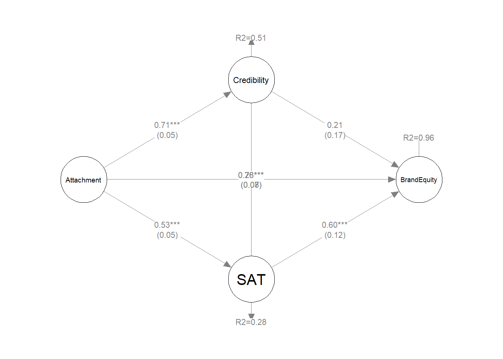

# Use LikertMakeR to replicate data from SEM results in a published report

## TL;DR

- **Goal:** Demonstrate how the **LikertMakeR** package can reconstruct
  survey data using only published summary statistics.

- **Source study:** *Dwivedi et al. (2019)*, which reports results from
  a 43-item survey of 340 respondents measuring 15 constructs.

- **Method:**

  - Generate synthetic scale scores with the same means and standard
    deviations as the published data.
  - Apply the reported correlation matrix to reproduce the relationships
    among variables.
  - Reconstruct plausible individual survey items using reported
    reliability (Cronbach’s $`\alpha`$).

- **Validation:** The synthetic dataset closely reproduces the published
  descriptive statistics, correlations, and scale reliabilities.

- **Result:** Structural equation modelling of the synthetic data
  produces relationships broadly consistent with those reported in the
  original paper.

- **Takeaway:** *LikertMakeR* can approximate realistic datasets from
  published results, enabling replication exercises, teaching examples,
  and methodological exploration when raw data are unavailable.

## Dwiveli et al. (2019) data replication

### Background

Researchers often publish **summary statistics** - means, standard
deviations, correlations, and reliability estimates - without releasing
the original data.

In teaching, simulation studies, and methodological work, it can be
useful to **reconstruct plausible datasets** from those published
summaries.

> **Prerequisites**
>
> This tutorial assumes a basic familiarity with:
>
> - Likert-scale survey data  
> - correlation matrices  
> - structural equation modelling
>
> Required R packages:
>
> - [`library(LikertMakeR)`](https://github.com/WinzarH/LikertMakeR/)
> - [`library(lavaan)`](https://lavaan.ugent.be)

The ***LikertMakeR*** package provides tools for doing exactly this:
generating synthetic Likert-scale datasets that reproduce the
statistical properties of reported data.

In this tutorial we demonstrate the process using a published study by
*Dwivedi et al. (2018)*, ([Note 1](#nte-dwivedi)). Using only the
statistics reported in their paper, we reconstruct a synthetic dataset
and show that it reproduces the key statistical relationships reported
in the original analysis.

*Dwivedi et al. (2018)*, [Note 1](#nte-dwivedi), sought to understand
social media platforms from a “brand” perspective through examining the
effect of consumers’ emotional attachment on social media consumer-based
brand equity (CBBE) using an online survey of 340 Australian social
media consumers, as shown in [Figure 1](#fig-model).

### Overview of the Reconstruction Process

Reconstructing a dataset from published statistics involves several
steps:

1.  Extract summary statistics from the published paper
2.  Reconstruct scale-level distributions (means and standard
    deviations)
3.  Reconstruct the correlation structure between scales
4.  Generate synthetic Likert-scale item responses consistent with those
    statistics
5.  Verify that the reconstructed dataset reproduces the reported
    results

We now walk through each step.

#### Verifying the Reconstruction

Reconstructing data from summary statistics inevitably involves
approximation.

To assess whether the reconstruction is credible, we compare several
properties of the synthetic dataset with those reported in the original
paper:

- scale means and standard deviations
- inter-scale correlations
- reliability estimates
- structural equation model results

If these statistics closely match the published values, the synthetic
data can be considered a reasonable reconstruction of the original
dataset.


Figure 1: Hypothesised relationships among variables. (*Dwivedi et
al. (2019))*

## Step 1: Extract summary statistics

To recreate a plausible dataset, we need to match the first two
statistical moments of each scale:

- the **mean** (average level of responses), and
- the **standard deviation** (spread of responses).

If synthetic data reproduce these two properties, the reconstructed
scales behave similarly to the original ones.

Fifteen constructs were measured with Likert scales constructed from 43
items (questions). Summary statistics from the study are shown in
[Table 1](#tbl-moments)

| construct                       | name | n_items | mean |   sd | alpha |
|:--------------------------------|:-----|--------:|-----:|-----:|------:|
| Affection (AFF)                 | AFF  |       2 | 2.51 | 0.93 |  0.87 |
| Connection (CON)                | CON  |       2 | 2.79 | 0.98 |  0.87 |
| Passion (PAS)                   | PAS  |       3 | 2.62 | 0.89 |  0.84 |
| Clarity of Positioning (COP)    | COP  |       3 | 3.52 | 0.70 |  0.80 |
| Brand trust (TRT)               | TRT  |       4 | 3.30 | 0.74 |  0.88 |
| Consumer satisfaction (SAT)     | SAT  |       3 | 3.87 | 0.64 |  0.86 |
| Awareness/associations (AWR)    | AWR  |       5 | 4.10 | 0.62 |  0.87 |
| Quality (QUL)                   | QUL  |       4 | 3.69 | 0.66 |  0.84 |
| Loyalty (LOY)                   | LOY  |       2 | 3.56 | 0.84 |  0.79 |
| Perceived differentiation (DIF) | DIF  |       2 | 3.80 | 0.78 |  0.85 |
| Self-brand congruence (FIT)     | FIT  |       2 | 3.02 | 0.83 |  0.82 |
| Extraversion (EXT)              | EXT  |       2 | 3.09 | 0.91 |  0.79 |
| Brand attitude (ATT)            | ATT  |       2 | 3.50 | 0.81 |  0.88 |
| Relationship proneness (REL)    | REL  |       3 | 2.90 | 0.83 |  0.79 |
| Involvement (INV)               | INV  |       4 | 3.32 | 0.92 |  0.79 |

Table 1: Summary statistics and variable properties. (*Dwivedi et
al. (2019))*

## Step 2: Reconstruct scale distributions

Generate data with same means & standard deviations.

With those summary statistics, we can synthesise a dataframe with the
same first and second moments as the original, using the
[`LikertMakeR::lfast()`](https://winzarh.github.io/LikertMakeR/reference/lfast.md)
function.

Show the code

``` r
library(LikertMakeR)

sample_size <- 340
lower <- 1
upper <- 5

set.seed(42)

base_data <- data.frame(
  AFF = lfast(sample_size, mean = 2.51, sd = 0.93, lower, upper, items = 2),
  CON = lfast(sample_size, mean = 2.79, sd = 0.98, lower, upper, items = 2),
  PAS = lfast(sample_size, mean = 2.62, sd = 0.89, lower, upper, items = 3),
  COP = lfast(sample_size, mean = 3.52, sd = 0.70, lower, upper, items = 3),
  TRT = lfast(sample_size, mean = 3.30, sd = 0.74, lower, upper, items = 4),
  SAT = lfast(sample_size, mean = 3.87, sd = 0.64, lower, upper, items = 3),
  AWR = lfast(sample_size, mean = 4.10, sd = 0.62, lower, upper, items = 5),
  QUL = lfast(sample_size, mean = 3.69, sd = 0.66, lower, upper, items = 4),
  LOY = lfast(sample_size, mean = 3.56, sd = 0.84, lower, upper, items = 2),
  DIF = lfast(sample_size, mean = 3.80, sd = 0.78, lower, upper, items = 2),
  FIT = lfast(sample_size, mean = 3.02, sd = 0.83, lower, upper, items = 2),
  EXT = lfast(sample_size, mean = 3.09, sd = 0.91, lower, upper, items = 2),
  ATT = lfast(sample_size, mean = 3.50, sd = 0.81, lower, upper, items = 2),
  REL = lfast(sample_size, mean = 2.90, sd = 0.83, lower, upper, items = 3),
  INV = lfast(sample_size, mean = 3.32, sd = 0.92, lower, upper, items = 4)
)
```

With this base dataframe, we check the summary statistics and find in
[Table 2](#tbl-base_data) that the means and standard deviations are the
same as in the reported data, to two decimal places.

|     |  mean |    sd |
|:----|------:|------:|
| AFF | 2.510 | 0.928 |
| CON | 2.790 | 0.979 |
| PAS | 2.621 | 0.892 |
| COP | 3.520 | 0.700 |
| TRT | 3.300 | 0.738 |
| SAT | 3.869 | 0.640 |
| AWR | 4.099 | 0.620 |
| QUL | 3.690 | 0.661 |
| LOY | 3.560 | 0.841 |
| DIF | 3.800 | 0.781 |
| FIT | 3.021 | 0.830 |
| EXT | 3.090 | 0.910 |
| ATT | 3.500 | 0.812 |
| REL | 2.900 | 0.832 |
| INV | 3.321 | 0.921 |

Table 2: Synthetic data summary statistics

## Step 3: Correlations to match published data

These existing synthetic data have random low correlations. We need to
correlate the variables according to the reported data. *Dwivedi et al.*
reported the correlation presented in
[Table 3](#tbl-show_target_correlations). This is our target correlation
matrix.

|     |  AFF |  CON |  PAS |  COP |  TRT |  SAT |  AWR |  QUL |  LOY |  DIF |  FIT |  EXT |  ATT |  REL |  INV |
|:----|-----:|-----:|-----:|-----:|-----:|-----:|-----:|-----:|-----:|-----:|-----:|-----:|-----:|-----:|-----:|
| AFF | 1.00 | 0.79 | 0.82 | 0.47 | 0.50 | 0.44 | 0.35 | 0.44 | 0.54 | 0.46 | 0.58 | 0.33 | 0.66 | 0.62 | 0.51 |
| CON | 0.79 | 1.00 | 0.77 | 0.43 | 0.49 | 0.42 | 0.36 | 0.41 | 0.56 | 0.41 | 0.61 | 0.32 | 0.65 | 0.61 | 0.49 |
| PAS | 0.82 | 0.77 | 1.00 | 0.46 | 0.51 | 0.46 | 0.40 | 0.48 | 0.55 | 0.45 | 0.60 | 0.36 | 0.73 | 0.62 | 0.48 |
| COP | 0.47 | 0.43 | 0.46 | 1.00 | 0.57 | 0.54 | 0.39 | 0.51 | 0.50 | 0.37 | 0.41 | 0.24 | 0.49 | 0.38 | 0.31 |
| TRT | 0.50 | 0.49 | 0.51 | 0.57 | 1.00 | 0.61 | 0.31 | 0.61 | 0.55 | 0.31 | 0.52 | 0.23 | 0.58 | 0.43 | 0.33 |
| SAT | 0.44 | 0.42 | 0.46 | 0.54 | 0.61 | 1.00 | 0.53 | 0.67 | 0.63 | 0.40 | 0.47 | 0.23 | 0.63 | 0.43 | 0.41 |
| AWR | 0.35 | 0.36 | 0.40 | 0.39 | 0.31 | 0.53 | 1.00 | 0.55 | 0.49 | 0.47 | 0.30 | 0.29 | 0.46 | 0.41 | 0.48 |
| QUL | 0.44 | 0.41 | 0.48 | 0.51 | 0.61 | 0.67 | 0.55 | 1.00 | 0.49 | 0.43 | 0.43 | 0.27 | 0.55 | 0.44 | 0.34 |
| LOY | 0.54 | 0.56 | 0.55 | 0.50 | 0.55 | 0.63 | 0.49 | 0.49 | 1.00 | 0.47 | 0.55 | 0.28 | 0.63 | 0.53 | 0.52 |
| DIF | 0.46 | 0.41 | 0.45 | 0.37 | 0.31 | 0.40 | 0.47 | 0.43 | 0.47 | 1.00 | 0.33 | 0.36 | 0.46 | 0.42 | 0.42 |
| FIT | 0.58 | 0.61 | 0.60 | 0.41 | 0.52 | 0.47 | 0.30 | 0.43 | 0.55 | 0.33 | 1.00 | 0.27 | 0.60 | 0.51 | 0.42 |
| EXT | 0.33 | 0.32 | 0.36 | 0.24 | 0.23 | 0.23 | 0.29 | 0.27 | 0.28 | 0.36 | 0.27 | 1.00 | 0.39 | 0.47 | 0.36 |
| ATT | 0.66 | 0.65 | 0.73 | 0.49 | 0.58 | 0.63 | 0.46 | 0.55 | 0.63 | 0.46 | 0.60 | 0.39 | 1.00 | 0.66 | 0.55 |
| REL | 0.62 | 0.61 | 0.62 | 0.38 | 0.43 | 0.43 | 0.41 | 0.44 | 0.53 | 0.42 | 0.51 | 0.47 | 0.66 | 1.00 | 0.71 |
| INV | 0.51 | 0.49 | 0.48 | 0.31 | 0.33 | 0.41 | 0.48 | 0.34 | 0.52 | 0.42 | 0.42 | 0.36 | 0.55 | 0.71 | 1.00 |

Table 3: Target correlation matrix. (*Dwivedi et al. (2019))*

We apply this correlation matrix to our existing data so that the
variables are correlated according to our target correlations, using the
[`LikertMakeR::lcor()`](https://winzarh.github.io/LikertMakeR/reference/lcor.md)
function.

Show the code

``` r
correlated_data <- LikertMakeR::lcor(
  data = base_data,
  target = dwivedi_correlations
)
names(correlated_data) <- varnames
```

And the revised dataframe should be correlated in the same way as the
published data. Results are shown in [Table 4](#tbl-synth_correlations).

Show the code

``` r
synth_correlations <- cor(correlated_data)
dimnames(synth_correlations) <- list(Rows = varnames, Cols = varnames)
```

|     |  AFF |  CON |  PAS |  COP |  TRT |  SAT |  AWR |  QUL |  LOY |  DIF |  FIT |  EXT |  ATT |  REL |  INV |
|:----|-----:|-----:|-----:|-----:|-----:|-----:|-----:|-----:|-----:|-----:|-----:|-----:|-----:|-----:|-----:|
| AFF | 1.00 | 0.79 | 0.82 | 0.47 | 0.50 | 0.44 | 0.35 | 0.44 | 0.54 | 0.46 | 0.58 | 0.33 | 0.66 | 0.62 | 0.51 |
| CON | 0.79 | 1.00 | 0.77 | 0.43 | 0.49 | 0.42 | 0.36 | 0.41 | 0.56 | 0.41 | 0.61 | 0.32 | 0.65 | 0.61 | 0.49 |
| PAS | 0.82 | 0.77 | 1.00 | 0.46 | 0.51 | 0.46 | 0.40 | 0.48 | 0.55 | 0.45 | 0.60 | 0.36 | 0.73 | 0.62 | 0.48 |
| COP | 0.47 | 0.43 | 0.46 | 1.00 | 0.57 | 0.54 | 0.39 | 0.51 | 0.50 | 0.37 | 0.41 | 0.24 | 0.49 | 0.38 | 0.31 |
| TRT | 0.50 | 0.49 | 0.51 | 0.57 | 1.00 | 0.61 | 0.31 | 0.61 | 0.55 | 0.31 | 0.52 | 0.23 | 0.58 | 0.43 | 0.33 |
| SAT | 0.44 | 0.42 | 0.46 | 0.54 | 0.61 | 1.00 | 0.53 | 0.67 | 0.63 | 0.40 | 0.47 | 0.23 | 0.63 | 0.43 | 0.41 |
| AWR | 0.35 | 0.36 | 0.40 | 0.39 | 0.31 | 0.53 | 1.00 | 0.55 | 0.49 | 0.47 | 0.30 | 0.29 | 0.46 | 0.41 | 0.48 |
| QUL | 0.44 | 0.41 | 0.48 | 0.51 | 0.61 | 0.67 | 0.55 | 1.00 | 0.49 | 0.43 | 0.43 | 0.27 | 0.55 | 0.44 | 0.34 |
| LOY | 0.54 | 0.56 | 0.55 | 0.50 | 0.55 | 0.63 | 0.49 | 0.49 | 1.00 | 0.47 | 0.55 | 0.28 | 0.63 | 0.53 | 0.52 |
| DIF | 0.46 | 0.41 | 0.45 | 0.37 | 0.31 | 0.40 | 0.47 | 0.43 | 0.47 | 1.00 | 0.33 | 0.36 | 0.46 | 0.42 | 0.42 |
| FIT | 0.58 | 0.61 | 0.60 | 0.41 | 0.52 | 0.47 | 0.30 | 0.43 | 0.55 | 0.33 | 1.00 | 0.27 | 0.60 | 0.51 | 0.42 |
| EXT | 0.33 | 0.32 | 0.36 | 0.24 | 0.23 | 0.23 | 0.29 | 0.27 | 0.28 | 0.36 | 0.27 | 1.00 | 0.39 | 0.47 | 0.36 |
| ATT | 0.66 | 0.65 | 0.73 | 0.49 | 0.58 | 0.63 | 0.46 | 0.55 | 0.63 | 0.46 | 0.60 | 0.39 | 1.00 | 0.66 | 0.55 |
| REL | 0.62 | 0.61 | 0.62 | 0.38 | 0.43 | 0.43 | 0.41 | 0.44 | 0.53 | 0.42 | 0.51 | 0.47 | 0.66 | 1.00 | 0.71 |
| INV | 0.51 | 0.49 | 0.48 | 0.31 | 0.33 | 0.41 | 0.48 | 0.34 | 0.52 | 0.42 | 0.42 | 0.36 | 0.55 | 0.71 | 1.00 |

Table 4: Synthetic data correlation matrix.

The synthetic data correlations appear to be the same, rounded to two
decimal places, as the target, published correlations.

To quantify how closely the reconstructed correlations match the
published ones, we compute the **Frobenius norm** of the difference
between the two matrices.

In simple terms, this measures the overall discrepancy between the two
correlation tables. A value close to zero indicates that the
reconstructed correlations closely match those reported in the paper.

The *Frobenius Norm* is defined as the square root of the sum of the
squares of all the matrix entries [Equation 1](#eq-frobenius).

``` math

F = \left( \sum_{i=1}^m \sum_{j=1}^n a_{ij}^2 \right)^{1/2}
 \qquad(1)
```

*Frobenius norm of a matrix.*

Show the code

``` r
mat_diff <- dwivedi_correlations - synth_correlations
frob_diff <- matrixcalc::frobenius.norm(mat_diff)
```

Calculated *Frobenius Norm* here is 0.0122667, which is very low for a
matrix of this size.

## Step 4: Generate synthetic Likert responses

So far we have reconstructed the statistical properties of the scales.
The next step is to generate individual Likert item responses consistent
with those statistics.

Given the correlated variables, we also have information on the nature
of the items that make each variable in [Table 1](#tbl-moments). This
allows us to estimate them too - thus giving us a complete set of
responses as we might have received them in the original survey.

We use the
[`LikertMakeR::makeItemsScale()`](https://winzarh.github.io/LikertMakeR/reference/makeItemsScale.md)
function.

Show the code

``` r
aff_items <- makeItemsScale(
  scale = correlated_data$AFF,
  lowerbound = 1, upperbound = 5, items = 2,
  alpha = 0.87, summated = FALSE
)
names(aff_items) <- c("aff1", "aff2")
```

Generating the other 14 sets of scale items works the same way.

The first ten observations are presented in [Table 5](#tbl-all_items).
They are all integer responses to standard 1-5 Likert-scale-type
questions.

       aff1 aff2 con1 con2 pas1 pas2 pas3 cop1 cop2 cop3 trt1 trt2 trt3 trt4 sat1
    1     2    2    2    2    3    1    2    4    2    2    1    3    3    2    4
    2     3    3    3    3    4    4    3    4    2    4    3    5    4    5    5
    3     2    1    2    2    2    1    1    4    2    4    3    5    3    3    4
    4     2    1    3    2    3    2    2    5    3    5    3    5    4    5    5
    5     2    2    4    3    3    2    3    4    2    4    3    4    4    5    4
    6     2    1    2    1    2    2    3    4    2    2    2    3    2    4    3
    7     3    3    3    3    4    3    3    4    2    2    2    4    3    3    4
    8     2    2    3    2    3    1    2    5    3    3    2    4    3    3    4
    9     3    2    2    1    3    1    2    4    2    3    2    4    3    4    5
    10    2    2    2    2    3    2    3    5    4    5    1    3    3    3    5
       sat2 sat3 awr1 awr2 awr3 awr4 awr5 qul1 qul2 qul3 qul4 loy1 loy2 dif1 dif2
    1     2    3    5    3    5    4    4    4    2    4    2    3    4    5    4
    2     4    4    5    3    5    5    5    5    3    4    5    5    5    5    4
    3     2    3    5    3    5    5    4    4    2    4    3    3    5    4    2
    4     4    5    5    3    5    5    4    5    3    4    5    4    5    4    2
    5     3    4    4    2    4    4    4    4    2    3    4    3    5    4    2
    6     2    3    5    3    5    4    4    4    2    4    3    2    4    3    1
    7     3    3    5    3    3    4    4    5    3    3    4    2    4    4    3
    8     3    4    4    2    4    4    4    4    2    4    3    2    3    4    2
    9     4    4    5    3    3    3    3    5    4    5    5    1    2    4    3
    10    3    4    5    3    5    5    4    5    3    5    3    3    5    5    4
       fit1 fit2 ext1 ext2 att1 att2 rel1 rel2 rel3 inv1 inv2 inv3 inv4
    1     1    3    4    2    4    3    2    4    2    5    2    3    4
    2     2    4    4    2    5    4    3    5    3    5    3    5    4
    3     3    4    2    1    3    3    1    3    2    4    4    2    2
    4     4    5    4    3    4    4    2    4    4    5    5    5    5
    5     3    5    4    2    4    3    1    3    3    5    3    2    3
    6     2    3    4    2    3    3    2    2    4    5    2    3    3
    7     4    5    4    2    4    3    2    4    4    5    3    3    2
    8     1    3    3    1    4    3    2    4    3    3    1    1    1
    9     2    3    4    3    3    3    1    3    3    3    1    1    1
    10    3    4    5    3    4    4    3    5    3    5    3    4    5

Table 5: First ten rows of our synthetic data - all 43 items

The resulting dataset contains simulated item responses that follow the
same statistical structure as the original study. Most achieved
Cronbach’s alpha are as desired as we can see in
[Table 6](#tbl-compare_alphas).

| construct | original | synthetic |
|:----------|---------:|----------:|
| AFF       |     0.87 |     0.869 |
| CON       |     0.87 |     0.869 |
| PAS       |     0.84 |     0.840 |
| COP       |     0.80 |     0.799 |
| TRT       |     0.88 |     0.879 |
| SAT       |     0.86 |     0.859 |
| AWR       |     0.87 |     0.869 |
| QUL       |     0.84 |     0.841 |
| LOY       |     0.79 |     0.791 |
| DIF       |     0.85 |     0.848 |
| FIT       |     0.82 |     0.821 |
| EXT       |     0.79 |     0.791 |
| ATT       |     0.88 |     0.880 |
| REL       |     0.79 |     0.790 |
| INV       |     0.79 |     0.790 |

Table 6: Comparison between Cronbach’s alphas for original published
constructs and synthetic costructs.

## Step 5: Reproduce relationship structure analysis

### Structural Equation Model

Now that we have a complete synthetic data set, we can analyse the data
to see if we can find the same relationships found by *Dwivedi et al.*

### original results

The original published results from *Dwivedi et al.* are reproduced in
[Table 7](#tbl-table_4).

| Estimated path | β | 95% CI | Hypothesis support |
|----|----|----|----|
| **Panel A: Hypothesised model results** |  |  |  |
| Emotional brand attachment → Brand credibility | 0.72 | 0.60-0.82 | Supported |
| Emotional brand attachment → Consumer satisfaction | 0.54 | 0.42-0.64 | Supported |
| Emotional brand attachment → Consumer-based brand equity (CBBE) | 0.21 | 0.03-0.40 | Not supported |
| Brand credibility → CBBE | 0.31 | 0.11-0.54 | Supported |
| Consumer satisfaction → CBBE | 0.63 | 0.50-0.76 | Supported |
| ***Total indirect effect*** |  |  |  |
| Emotional brand attachment (EBA) → CBBE | 0.57 | 0.42-0.77 |  |
| ***Specific indirect effects*** |  |  |  |
| EBA → CBBE via Brand credibility | 0.09 | 0.03-0.18 | Supported |
| EBA → CBBE via Consumer satisfaction | 0.14 | 0.09-0.21 | Supported |
| **Panel B: Alternative model results** |  |  |  |
| Emotional brand attachment → Brand credibility | 0.74 | 0.61-0.84 | Supported |
| Emotional brand attachment → Consumer satisfaction | 0.56 | 0.44-0.68 | Supported |
| Emotional brand attachment → Brand loyalty | 0.40 | 0.17-0.61 | Supported |
| Brand credibility → Brand loyalty | 0.14 | 0.07-0.45 | Not supported |
| Consumer satisfaction → Brand loyalty | 0.35 | 0.19-0.53 | Supported |
| ***Specific indirect effects*** |  |  |  |
| EBA → LOY via Consumer satisfaction | 0.12 | 0.06-0.20 | Supported |

Table 7: Parameter estimates of the hypothesised and alternative
models - Table IV from *Dwivedi et al. (2019)*.

### Results from synthetic data

The authors of the original paper used the *AMOS* program, which is a
part of ***SPSS***. I haven’t used *SPSS/AMOS* for a very long time, so
I’ll run my analysis using the `lavaan` package for ***R***. By default,
*AMOS* uses Maximum Likelihood (ML) estimation, while *lavaan* uses
Robust Maximum Likelihood (MLR). With ML specified and bootstrapped
confidence interval estimates, we *should* get comparable output.

Show the code

``` r
# model definition
model <- "
# first-order constructs
    AFF =~ aff1 + aff2
    CON =~ con1 + con2
    PAS =~ pas1 + pas2 + pas3
    AWR =~ awr1 + awr2 + awr3 + awr4 + awr5
    QUL =~ qul1 + qul2 + qul3 + qul4
    LOY =~ loy1 + loy2
    COP =~ cop1 + cop2 + cop3
    TRT =~ trt1 + trt2 + trt3 + trt4
    SAT =~ sat1 + sat2 + sat3
# second-ordr constructs
    Attachment =~  AFF + CON + PAS
    Credibility =~ TRT + COP
    BrandEquity =~ AWR + QUL + LOY
# structural model
    Credibility ~ H1*Attachment
    SAT ~ H2*Attachment
    BrandEquity ~ H3*Attachment + H4*Credibility + H5*SAT
# allow correlation between mediators
   Credibility ~~ SAT
# Specific indirect effects
  ind_Attachment_via_Credibility := H1 * H4
  ind_Attachment_via_SAT := H2 * H5
# Total indirect effect
  total_ind_Attachment := (H1 * H4) + (H2 * H5)
# Total effect
  total_Attachment := H3 + total_ind_Attachment
"
# run the model
sem_result <- lavaan::sem(
  model,
  data = all_items,
  estimator = "ML" #,
  # se = "bootstrap",
  # bootstrap = 2000
)

# extract standardised results
std_results <- lavaan::standardizedSolution(sem_result)
# Keep only structural and indirect effects
std_structural <- std_results[
  std_results$op %in% c("~", ":="),
]
# Keep only regressions (~) and defined parameters (:=)
std_results <- std_results[std_results$op %in% c("~", ":="), ]
# Get bootstrap CI from parameterEstimates
boot_pe <- lavaan::parameterEstimates(
  sem_result,
  standardized = TRUE,
  ci = TRUE,
  boot.ci.type = "bca.simple"
)
boot_pe <- boot_pe[boot_pe$op == ":=", ]
```

In this paper, we confine ourselves to the main theoretical model shown
in *Panel A*. Parameter estimates of the hypothesised model are
summarised in [Table 8](#tbl-sem_summary). We can see that not all the
figures are the exactly the same as in the original, but they are very
close and the conclusions are the same.

| Estimated path                 | β    | 95% CI          |
|--------------------------------|------|-----------------|
| **Direct effects**             |      |                 |
| Attachment → Credibility       | 0.71 | \[0.62, 0.8\]   |
| Attachment → SAT               | 0.53 | \[0.44, 0.62\]  |
| Attachment → BrandEquity       | 0.28 | \[0.12, 0.44\]  |
| Credibility → BrandEquity      | 0.21 | \[-0.12, 0.54\] |
| SAT → BrandEquity              | 0.60 | \[0.37, 0.84\]  |
| **Indirect and total effects** |      |                 |
| ind_Attachment_via_Credibility | 0.15 | \[-0.09, 0.39\] |
| ind_Attachment_via_SAT         | 0.32 | \[0.18, 0.45\]  |
| total_ind_Attachment           | 0.47 | \[0.33, 0.61\]  |
| total_Attachment               | 0.75 | \[0.67, 0.82\]  |

Table 8: Parameter estimates of the hypothesised model - From synthetic
data.

A graphic representation of the structural component of the SEM model
created by the synthetic data is presented in
[Figure 2](#fig-synthetic_model).



Figure 2: Structural model of Synthetic data - reproducing original
data.

## Conclusion

This exercise set out to see if we can use functions in the
*LikertMakeR* package to “reproduce” raw data based on summary
statistics presented in a published report. We find that results are
surprisingly strong - producing data that give similar output to those
in the original report, and giving the same conclusions. Of course we
cannot expect the data to give exactly the same results - after all,
they are artificial and subject to rounding of the reported output.

### What we have learned

This reconstruction demonstrates that synthetic Likert-scale data can be
generated from published summary statistics with high fidelity.

Even though the original raw data are unavailable, the reconstructed
dataset reproduces:

- the reported scale distributions
- the correlation structure between constructs
- the reliability estimates
- the results of the structural equation model

This makes synthetic reconstruction useful for:

- teaching statistical methods
- replicating published analyses
- conducting methodological simulations when raw data are unavailable.

------------------------------------------------------------------------

> **Note 1: Reference**
>
> Dwivedi A, Johnson LW, Wilkie DC, De Araujo-Gil L (2019). Consumer
> emotional brand attachment with social media brands and social media
> brand equity. *European Journal of Marketing*, 53(6): 1176–1204, doi:
> <https://doi.org/10.1108/EJM-09-2016-0511>
