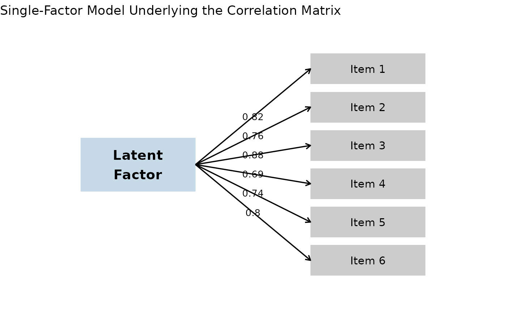

# How \`makeCorrAlpha()\` Works: Then and Now

## Introduction

One of the most-used functions in **LikertMakeR** is
[`makeCorrAlpha()`](https://winzarh.github.io/LikertMakeR/reference/makeCorrAlpha.md).

Its purpose is simple:

> Given a number of items and a target *Cronbach’s alpha*, generate a
> correlation matrix that has approximately that reliability.

Behind that simple description are two quite different strategies.  
Earlier versions of the function used one approach. The current version
uses a new constructive method that more closely reflects how real
psychometric scales are built.

This note explains both approaches.

------------------------------------------------------------------------

## The Goal

Suppose we want:

- 8 items  
- Cronbach’s alpha = 0.85

Cronbach’s alpha depends on the **average inter-item correlation**.

So the practical task is:

> Build a correlation matrix where the average correlation between items
> corresponds to alpha = 0.85.

There is an important constraint:

A valid correlation matrix must be **Positive Definite**.

In simple terms, this means the matrix must represent a
mathematically-valid set of variables. Not every table of numbers
between −1 and +1 qualifies.

That constraint is what makes the problem interesting.

------------------------------------------------------------------------

## The Previous Approach: Random + Repair

Earlier versions of
[`makeCorrAlpha()`](https://winzarh.github.io/LikertMakeR/reference/makeCorrAlpha.md)
worked in two stages.

### Step 1: Generate Random Correlations

The function would:

1.  Compute the average correlation required for the requested alpha.
2.  Generate many random values around that average.
3.  Insert them into a symmetric matrix.
4.  Set the diagonal values to 1.

At this point, the matrix *looked* like a correlation matrix.

But there was a problem.

> Randomly assembled correlation matrices are often **Not Positive
> Definite**.

That means they do not represent a mathematically valid set of
variables.

------------------------------------------------------------------------

### Step 2: Adjust Until Valid

To fix this, the function repeatedly:

- Swapped correlation values,
- Checked the matrix *eigenvalues*,
- Tested whether the matrix had become positive definite.

This worked very well for small to moderate numbers of items (for
example, 4–12 items), which covers most applied research examples.

However, as the number of items grew:

- The search process could become slower,
- Many swaps might be required,
- Occasionally, no valid solution was found within the iteration limit.

In short:

> The method generated something random and then repaired it.

It was effective, but indirect.

- It was slow
- It often produced a correlation matrix which had eigenvalues where
  more than two values exceeded ‘1’, which often implies that the data
  represents a multi-factor data structure. That is, it was not
  represent a unidimensional construct.

------------------------------------------------------------------------

## The New Approach: Construct Instead of Repair

The current version of
[`makeCorrAlpha()`](https://winzarh.github.io/LikertMakeR/reference/makeCorrAlpha.md)
uses a different idea.

Instead of generating correlations randomly and hoping they form a valid
structure, it starts from a simple model of how psychometric scales
actually work.

------------------------------------------------------------------------

### How Real Scales Work

Most multi-item scales in psychology, marketing, and education are built
around a single underlying construct, such as:

- Attitude  
- Satisfaction  
- Trust  
- Anxiety  
- Engagement

Each item reflects that underlying factor to some degree.

In statistical language, this is a **one-factor model**.

Under this model:

- Each item has a *loading* (how strongly it reflects the construct).
- Correlations between items arise because they share the same
  underlying factor.

This guarantees something important:

> If items are generated from a common factor structure, the resulting
> correlation matrix is automatically positive definite.

No repair is required.

------------------------------------------------------------------------

## The New Method

The new version of
[`makeCorrAlpha()`](https://winzarh.github.io/LikertMakeR/reference/makeCorrAlpha.md)
works like this:

1.  **Compute the average correlation implied by the requested alpha.**
2.  **Generate item loadings** that vary around a central value.
3.  **Construct the correlation matrix directly** from those loadings.
4.  **Make small adjustments if necessary** to ensure the target alpha
    is met.

Because the matrix is built from a factor model, it is valid by
construction.

There is no swapping, no repairing, and no iterative reshuffling of
entries.

------------------------------------------------------------------------

### A Comparison

|            Previous Version             |              Current Version              |
|:---------------------------------------:|:-----------------------------------------:|
|              Target alpha               |               Target alpha                |
|                    ↓                    |                     ↓                     |
|      Random correlations generated      |        Implied average correlation        |
|                    ↓                    |                     ↓                     |
|            Matrix assembled             | Generate item loadings (one-factor model) |
|                    ↓                    |                     ↓                     |
|        Is it positive definite?         |   Construct correlation matrix directly   |
|                    ↓                    |                     ↓                     |
| If not → swap correlations → test again |              Valid by design              |
|                    ↓                    |                                           |
|         Eventually valid matrix         |                                           |
|                                         |                                           |

The difference is conceptual as much as computational.

- **Old method:** generate first, repair later.
- **New method:** construct from a coherent measurement model.

------------------------------------------------------------------------

## Why This Better Reflects Psychometric Scales

In real measurement:

- Items are not randomly related.
- They share a common construct.
- Their correlations arise from that shared source.

The new generator mirrors this logic.

Instead of treating correlations as independent numbers that must be
forced into a valid shape, it assumes:

> Items are indicators of a single latent factor.

That assumption aligns closely with classical test theory and common
practice in scale development.

------------------------------------------------------------------------

## What Has Changed for Users?

For most users, nothing.

For most everyday uses — especially with moderate numbers of items — the
results will look very similar.

However, the new method:

- Is more stable for larger numbers of items.
- Avoids rare non-convergence situations.
- Produces smoother, more realistic correlation patterns.
- Guarantees a positive-definite matrix by construction.

The `precision` argument has been deprecated and replaced with an
`alpha_noise` argument.

The nature of the `variance` argument has changed, but not its purpose.

The `sort_cors` argument has been deprecated.

#### Understanding variance and alpha_noise

The redesigned
[`makeCorrAlpha()`](https://winzarh.github.io/LikertMakeR/reference/makeCorrAlpha.md)
function now includes two independent controls:

##### variance — How different are the items?

The variance argument controls how much the items differ from each other
in strength.

- Smaller values produce very similar items (nearly equal correlations).

- Larger values produce more heterogeneous items (wider spread of
  correlations).

For most teaching and applied examples:

- `variance = 0.05` → near-parallel items

- `variance = 0.10` → modest heterogeneity (recommended default)

- `variance = 0.15` → strong heterogeneity

- `variance > 0.20` → very strong dispersion

Importantly, variance changes the pattern of correlations, but not the
requested reliability level.

##### `alpha_noise` — How exact should alpha be?

The `alpha_noise` argument controls whether the requested Cronbach’s
alpha is reproduced exactly, or allowed to vary slightly across runs.

- `alpha_noise = 0` → exact, deterministic alpha

- `alpha_noise = 0.02` → very small variation

- `alpha_noise = 0.05` → moderate variation

- `alpha_noise = 0.10` → substantial variation

This can be useful in teaching or simulation settings where you want
each run to look slightly different, rather than reproducing the same
reliability every time.

In summary:

- `variance` controls item heterogeneity.

- `alpha_noise` controls reliability variability.

These two parameters operate independently, allowing you to simulate
realistic measurement structures while maintaining control over
reliability.

------------------------------------------------------------------------

## Summary

The previous method worked well and served most practical purposes.

The new method is conceptually cleaner.

Instead of building a matrix and fixing it, we now build it correctly
from the start — using the same underlying logic that real psychometric
scales are based on.

It is also way faster.

In short:

> The new
> [`makeCorrAlpha()`](https://winzarh.github.io/LikertMakeR/reference/makeCorrAlpha.md)
> does not just generate correlations.  
> It generates a measurement model.

And that is a more natural foundation for Likert-scale simulation.
