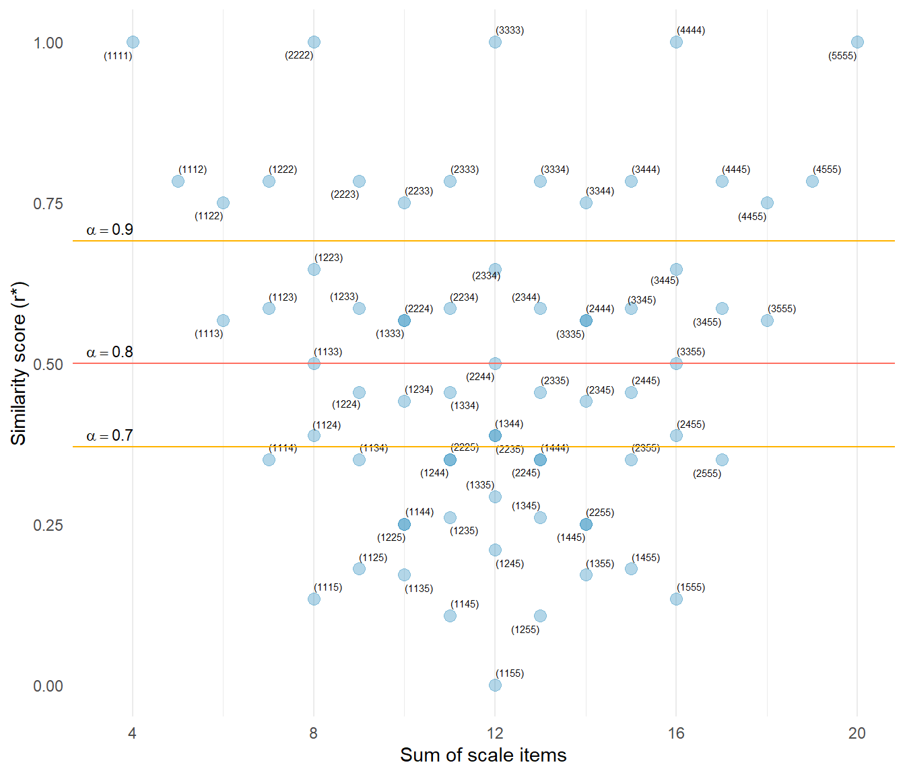

# makeItemsScale() explainer

## Reconstructing Likert Items from Scale Scores with a Target Reliability

In many situations researchers have access to scale scores but not the
individual item responses that produced them. For example, published
studies often report only summary statistics, simulation studies may
require synthetic item data, and teaching examples may benefit from
realistic item responses. Generating such data is not straightforward
because the reconstructed items must satisfy two constraints
simultaneously: the item values must sum to the observed scale score,
and the items should exhibit a desired level of reliability.

The
[`makeItemsScale()`](https://winzarh.github.io/LikertMakeR/reference/makeItemsScale.md)
function addresses this problem by reconstructing plausible Likert-style
item responses whose sums reproduce the supplied scale scores while
approximating a target *Cronbach’s alpha*. The algorithm achieves this
by selecting candidate item combinations whose dispersion corresponds to
the inter-item correlation implied by the desired reliability.

Reconstructed item-level Likert responses must satisfy two constraints:

1.  The item values must sum to a given scale score.
2.  The items should exhibit a desired reliability (Cronbach’s
    $`\alpha`$).

Show the code

``` r
## load required packages
library(dplyr)
library(ggplot2)
library(ggrepel)
library(gtools)
library(knitr)
library(kableExtra)
library(LikertMakeR)
```

Quick example:

The short dataset in [Table 1](#tbl-opening_example) shows a four-item
5-point Likert scale, `myScale` for which we want to produce scale items
that match the scores in the dataset and have *Cronbach’s alpha* of
`0.80`. This result is achieved in the four columns, `V1 ... V4` which
average to equal the corresponding values in `myScale`.

Show the code

``` r
n <- 16
mean <- 3
sd <- 1.0
lower <- 1
upper <- 5
k <- 4

target_alpha <- 0.8

df <- data.frame(
  myScale = lfast(
    n = n, mean = mean, sd = sd,
    lowerbound = lower, upperbound = upper,
    items = k
  )
)

myItems <- makeItemsScale(
  scale = df,
  lowerbound = lower,
  upperbound = upper,
  items = k,
  alpha = target_alpha,
  summated = FALSE
)

myAlpha <- alpha(, myItems) |> round(4)

df <- cbind(df, myItems)

knitr::kable(df)
```

| myScale |  V1 |  V2 |  V3 |  V4 |
|--------:|----:|----:|----:|----:|
|    3.50 |   4 |   2 |   5 |   3 |
|    3.00 |   4 |   2 |   4 |   2 |
|    3.25 |   5 |   2 |   3 |   3 |
|    3.75 |   4 |   2 |   4 |   5 |
|    3.25 |   5 |   3 |   3 |   2 |
|    1.25 |   2 |   1 |   1 |   1 |
|    1.50 |   3 |   1 |   1 |   1 |
|    2.25 |   4 |   2 |   2 |   1 |
|    4.50 |   5 |   3 |   5 |   5 |
|    2.25 |   4 |   2 |   1 |   2 |
|    1.50 |   1 |   1 |   1 |   3 |
|    3.25 |   5 |   2 |   3 |   3 |
|    3.25 |   3 |   2 |   5 |   3 |
|    4.50 |   5 |   5 |   5 |   3 |
|    3.25 |   5 |   2 |   3 |   3 |
|    3.75 |   4 |   2 |   4 |   5 |

Table 1: Short Example: 4-item 5-point Likert scale, alpha = 0.8

Here, the resulting *Cronbach’s alpha* = 0.7993, so the synthetic data
are correct to two decimal places. Not bad for just 16 observations!
*(Actually, number of observations has little to do with **alpha**)*

The
[`makeItemsScale()`](https://winzarh.github.io/LikertMakeR/reference/makeItemsScale.md)
function generates such data by selecting candidate item combinations
whose dispersion matches the correlation structure implied by the target
reliability.

The key idea is that rows with similar item values produce stronger
correlations between items, while rows with widely varying values
produce weaker correlations.

### Relationship between reliability and correlation

Cronbach’s alpha depends on the **average inter-item correlation**:

``` math

\alpha = \frac{k \bar r}{1 + (k - 1) \bar r}
```

where

- $`k`$ = number of items
- $`\bar r`$ = mean inter-item correlation.

Rearranging gives the correlation implied by a desired reliability:

``` math

\bar r = \frac{\alpha}{k - \alpha (k - 1)}
```

#### Example

Suppose we want

- 4 items
- target $`\alpha`$ = 0.80

Then

``` math

\bar r = \frac{0.80}{4 - 0.80 (3)} = 0.5
```

Typically, we would formalise this calculation with a function.

Show the code

``` r
alpha_2_r <- function(target_alpha, k) {
  mean_r <- target_alpha / (k - target_alpha * (k - 1))

  return(mean_r)
}
```

So the reconstructed items should exhibit an average correlation of
approximately $`0.50`$.

### Candidate rows

The algorithm first generates all possible item combinations within the
response bounds.

For a 4-item 1–5 scale, there are 70 possible rows (aka: *combinations
with replacement*), as shown in [Table 2](#tbl-head_candidates).

Show the code

``` r
#|
lower <- 1
upper <- 5
k <- 4


candidates <- gtools::combinations(
  v = c(lower:upper),
  r = k,
  n = length(c(lower:upper)),
  repeats.allowed = TRUE
) |>
  data.frame()
```

|     | X1  | X2  | X3  | X4  |
|:----|:----|:----|:----|:----|
| 1   | 1   | 1   | 1   | 1   |
| 2   | 1   | 1   | 1   | 2   |
| 3   | 1   | 1   | 1   | 3   |
| 4   | 1   | 1   | 1   | 4   |
| 5   | 1   | 1   | 1   | 5   |
| 6   | 1   | 1   | 2   | 2   |
| 7   | …   | …   | …   | …   |
| 65  | 3   | 5   | 5   | 5   |
| 66  | 4   | 4   | 4   | 4   |
| 67  | 4   | 4   | 4   | 5   |
| 68  | 4   | 4   | 5   | 5   |
| 69  | 4   | 5   | 5   | 5   |
| 70  | 5   | 5   | 5   | 5   |

Table 2: Candidate rows

A scale made from six 5-point items has 210 possible combinations. A
scale made from three 7-point items has 84 possible combinations.

Each candidate row represents a possible pattern of item responses.

Each row sums to a value that could be appear in a summated scale.
Similarly, each row shows variation in its values, as measured by the
row standard deviation

``` math

s = \sqrt{\frac{1}{k - 1}\sum^k_{i=1}  (x_i - \bar x)^2}
```

Rows with small $`s`$ contain similar item values, implying stronger
correlations.

Rows with large $`s`$ contain more varied values, implying weaker
correlations.

Show the code

``` r
candidates$sum <- rowSums(candidates[, 1:k])
candidates$sd <- apply(X = candidates[, 1:k], MARGIN = 1, FUN = sd)
```

|     | X1  | X2  | X3  | X4  | sum | sd     |
|:----|:----|:----|:----|:----|:----|:-------|
| 1   | 1   | 1   | 1   | 1   | 4   | 0      |
| 2   | 1   | 1   | 1   | 2   | 5   | 0.5    |
| 3   | 1   | 1   | 1   | 3   | 6   | 1      |
| 4   | 1   | 1   | 1   | 4   | 7   | 1.5    |
| 5   | 1   | 1   | 1   | 5   | 8   | 2      |
| 6   | 1   | 1   | 2   | 2   | 6   | 0.5774 |
| 7   | …   | …   | …   | …   | …   | …      |
| 65  | 3   | 5   | 5   | 5   | 18  | 1      |
| 66  | 4   | 4   | 4   | 4   | 16  | 0      |
| 67  | 4   | 4   | 4   | 5   | 17  | 0.5    |
| 68  | 4   | 4   | 5   | 5   | 18  | 0.5774 |
| 69  | 4   | 5   | 5   | 5   | 19  | 0.5    |
| 70  | 5   | 5   | 5   | 5   | 20  | 0      |

Table 3: sum and sd of candidate rows

#### Similarity index

To relate row dispersion to correlation, the algorithm converts the
standard deviation into a **similarity index**

``` math

r^* = 1 - \frac{s}{s_{max}}
```

where

- $`s`$ = row standard deviation
- $`s_{max}`$ = maximum dispersion observed among candidate rows.

This transformation maps dispersion onto a scale between $`0`$ (low
similarity) and $`1`$ (high similarity).

The similarity index is calculated using the maximum dispersion observed
across all possible item combinations within the response range.

Rows with similar values therefore have large $`r^*`$

Show the code

``` r
s_max <- max(candidates$sd)

candidates$similar <- 1 - candidates$sd / s_max
```

|     | X1  | X2  | X3  | X4  | sum | sd     | similar |
|:----|:----|:----|:----|:----|:----|:-------|:--------|
| 1   | 1   | 1   | 1   | 1   | 4   | 0      | 1       |
| 2   | 1   | 1   | 1   | 2   | 5   | 0.5    | 0.7835  |
| 3   | 1   | 1   | 1   | 3   | 6   | 1      | 0.567   |
| 4   | 1   | 1   | 1   | 4   | 7   | 1.5    | 0.3505  |
| 5   | 1   | 1   | 1   | 5   | 8   | 2      | 0.134   |
| 6   | 1   | 1   | 2   | 2   | 6   | 0.5774 | 0.75    |
| 7   | …   | …   | …   | …   | …   | …      | …       |
| 65  | 3   | 5   | 5   | 5   | 18  | 1      | 0.567   |
| 66  | 4   | 4   | 4   | 4   | 16  | 0      | 1       |
| 67  | 4   | 4   | 4   | 5   | 17  | 0.5    | 0.7835  |
| 68  | 4   | 4   | 5   | 5   | 18  | 0.5774 | 0.75    |
| 69  | 4   | 5   | 5   | 5   | 19  | 0.5    | 0.7835  |
| 70  | 5   | 5   | 5   | 5   | 20  | 0      | 1       |

Table 4: Top and bottom rows of candidate similarities

#### Selecting candidate rows

For each candidate row we compute the absolute difference between the
target mean correlation coefficient and the row similarity score.

``` math

| {r^* - \bar r} |
```

where

- $`r^*`$ = row similarity
- $`\bar r`$ = target mean correlation.

Rows whose similarity index is **closest to the target correlation** are
preferred.

### Visual explanation of candidate selection

[Figure 1](#fig-similarity_sum_graphic) shows all 70 possible
combinations of four 5-point items. Each point represents one
combination of four items, arranged by the sum of items and the
similarity score. Sum-of-items ranges from ‘4’ `1111` to ‘20’ `5555`,
and the similarity score ranges from ‘0’ (minimum similarity/ maximum
variance - here representing `1155` to ‘1’ (perfect similarity/ zero
variance). Note the five points at the top, at similarity = ‘1’ that
represent the combinations where all item values are equal.

We find the “best” combination at the intersection of the given sum and
our target alpha. Recall that, with four items, a target alpha of ‘0.80’
corresponds to a mean correlation of ‘0.5’.

For example, if we have a scale that sums to ‘8’, we see there are five
combinations with that sum: `2222`, `1223`, `1133`, `1124`, and `1115`,
with progressively decreasing similarity score. With a target alpha of
‘0.80’ then we select combination `1133`, (similarity=‘0.5’). If target
alpha is ‘0.70’, corresponding to similarity=‘0.368’ the closest
combination is `1124`, so that is chosen. And we choose `1223` if target
alpha is ‘0.90’ (similarity=‘0.692’).



Figure 1: Possible combinations of four 5-point items. Select best
combination at the intersection of given sum and desired alpha.

### Worked example 1

**Four 5-point items with summed score = 12**

Suppose a respondent’s scale score is **12**.

We must find item values such that

``` math

x_1 + x_2 + x_3 +x_4 = 12
```

Possible combinations include:

Show the code

``` r
sums_12 <- filter(candidates, sum == 12)

print(sums_12)
```

      X1 X2 X3 X4 sum        sd   similar  label
    1  1  1  5  5  12 2.3094011 0.0000000 (1155)
    2  1  2  4  5  12 1.8257419 0.2094306 (1245)
    3  1  3  3  5  12 1.6329932 0.2928932 (1335)
    4  1  3  4  4  12 1.4142136 0.3876276 (1344)
    5  2  2  3  5  12 1.4142136 0.3876276 (2235)
    6  2  2  4  4  12 1.1547005 0.5000000 (2244)
    7  2  3  3  4  12 0.8164966 0.6464466 (2334)
    8  3  3  3  3  12 0.0000000 1.0000000 (3333)

Recall the target correlation is **0.50**.

The row

`2 2 4 4`

has similarity **0.50**, which is closest to the target similarity
score. So this row is selected (and later permuted across item
positions). You can verify this in
[Figure 1](#fig-similarity_sum_graphic).

### Worked example 2

**Four 5-point items with summed score = 7**

Now consider a scale score of **7**.

Possible rows include:

Show the code

``` r
sums_7 <- filter(candidates, sum == 7)

print(sums_7)
```

      X1 X2 X3 X4 sum        sd   similar  label
    1  1  1  1  4   7 1.5000000 0.3504809 (1114)
    2  1  1  2  3   7 0.9574271 0.5854219 (1123)
    3  1  2  2  2   7 0.5000000 0.7834936 (1222)

The row

`1 1 2 3`

has similarity closest to the target similarity (0.50), so it is
selected. Check also in [Figure 1](#fig-similarity_sum_graphic).

### Constructing the dataset

The algorithm repeats this process for every scale score.

1.  Identify candidate rows that sum to the required score
2.  Compute dispersion for each candidate
3.  Convert dispersion to similarity index
4.  Select the row whose similarity best matches the target correlation
5.  Randomly permute item positions

Finally, a short optimisation step rearranges item values within rows to
improve the overall correlation structure while preserving each row sum.

### The final optimisation step

The short optimisation step takes the selected rows that correspond to
the desired scale sums and iteratively rearranges values within each row
until the desired Cronbach’s alpha is achieved.

This step implements a stochastic local search procedure in which small,
random perturbations are applied to individual rows and retained only if
they improve the fit to the target reliability.

The algorithm follows the following steps:

1.  Initialise the current dataset as the best dataset.
2.  Repeat:
    - Randomly select a row.
    - Randomly select two positions within that row and swap their
      values.
    - Recalculate Cronbach’s alpha for the updated dataset.
    - If the new alpha is closer to the target value, retain the change
      (i.e., update the best dataset); otherwise, revert the swap.
3.  Stop when the alpha falls within a specified tolerance of the
    target; otherwise, continue iterating.

The effect of the optimisation step is best shown with an example.
Consider a scale similar to that shown at the top of this explainer,
[Table 5](#tbl-selectItems), this time with eight observations for
brevity.

The function
[`LikertMakeR::makeItemsScale()`](https://winzarh.github.io/LikertMakeR/reference/makeItemsScale.md)
accepts a given vector of Likert-scale values, as either means or as a
summated scale, and then extracts appropriate item combinations for the
desired Cronbach’s alpha.

| scale | sums |  V1 |  V2 |  V3 |  V4 |
|------:|-----:|----:|----:|----:|----:|
|  4.25 |   17 |   3 |   4 |   5 |   5 |
|  2.25 |    9 |   1 |   2 |   2 |   4 |
|  2.25 |    9 |   1 |   2 |   2 |   4 |
|  1.75 |    7 |   1 |   1 |   2 |   3 |
|  4.25 |   17 |   3 |   4 |   5 |   5 |
|  2.75 |   11 |   1 |   3 |   3 |   4 |
|  4.00 |   16 |   3 |   3 |   5 |   5 |
|  2.50 |   10 |   1 |   2 |   3 |   4 |

Table 5: Given Scale (mean=3, sd=1), and selected item combinations for
target alpha=0.8

As part of the same process, as shown in [Table 6](#tbl-randItems), the
values within each selected item combination are randomly rearranged.

|  V1 |  V2 |  V3 |  V4 |
|----:|----:|----:|----:|
|   5 |   4 |   3 |   5 |
|   1 |   4 |   2 |   2 |
|   4 |   2 |   1 |   2 |
|   3 |   2 |   1 |   1 |
|   4 |   5 |   3 |   5 |
|   1 |   4 |   3 |   3 |
|   3 |   3 |   5 |   5 |
|   1 |   2 |   3 |   4 |

Table 6: Derived scale items before optimisation ($`\alpha`$ = 0.676)

Comparison of the initial scale reconstruction
([Table 5](#tbl-selectItems)), and then the randomised scales
([Table 6](#tbl-randItems)) and optimised scales
([Table 7](#tbl-trueItems)) show identical row values, but only the
optimised arrangement achieves the target reliability.

|  V1 |  V2 |  V3 |  V4 |
|----:|----:|----:|----:|
|   4 |   5 |   3 |   5 |
|   4 |   2 |   2 |   1 |
|   1 |   2 |   2 |   4 |
|   1 |   3 |   2 |   1 |
|   3 |   5 |   4 |   5 |
|   1 |   4 |   3 |   3 |
|   3 |   5 |   3 |   5 |
|   1 |   4 |   3 |   2 |

Table 7: Derived scale items after optimisation ($`\alpha`$ = 0.799)

Correlation matrices of the data, before and after the alpha-search
optimisation step, are presented in [Table 8](#tbl-cor_random) and
[Table 9](#tbl-cor_optim).

We see that randomly-allocated row values produce mean correlations
well-below that required to achieve the desired alpha, but after
optimisation the values are typically correct within two decimal places.

|     |  V1   |  V2  |  V3   |  V4  |
|:----|:-----:|:----:|:-----:|:----:|
| V1  | 1.00  | 0.12 | -0.05 | 0.33 |
| V2  | 0.12  | 1.00 | 0.35  | 0.48 |
| V3  | -0.05 | 0.35 | 1.00  | 0.83 |
| V4  | 0.33  | 0.48 | 0.83  | 1.00 |

Table 8: Item correlations before optimisation (\$\alpha\$ = 0.676)

|     |  V1  |  V2  |  V3  |  V4  |
|:----|:----:|:----:|:----:|:----:|
| V1  | 1.00 | 0.28 | 0.22 | 0.32 |
| V2  | 0.28 | 1.00 | 0.87 | 0.67 |
| V3  | 0.22 | 0.87 | 1.00 | 0.63 |
| V4  | 0.32 | 0.67 | 0.63 | 1.00 |

Table 9: Item correlations after optimisation (\$\alpha\$ = 0.799)

### Why this works

Cronbach’s alpha depends on the average correlation between items across
respondents. By selecting candidate rows whose within-row dispersion
corresponds to the desired correlation level, the algorithm indirectly
controls the covariance structure of the generated dataset.

Rows with similar item values generate stronger correlations, while rows
with more varied values generate weaker correlations. By selecting rows
with the appropriate similarity level for each scale score, the
algorithm produces datasets whose observed reliability closely matches
the requested value.

Many different candidate rows share identical dispersion values. When
this occurs at the same sum-value, the algorithm randomly selecting
among tied candidates. This avoids systematic preference for particular
partitions while preserving the desired correlation structure.

Candidate item partitions produce a discrete set of dispersion values,
which means the achieved reliability can only approximate the requested
value. In simulation tests the deviation from the target Cronbach’s
$`\alpha`$ is typically less than `0.001`.
