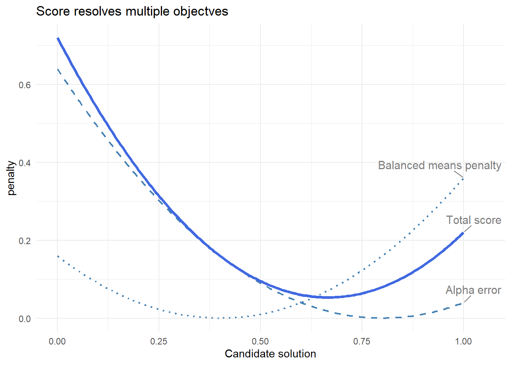
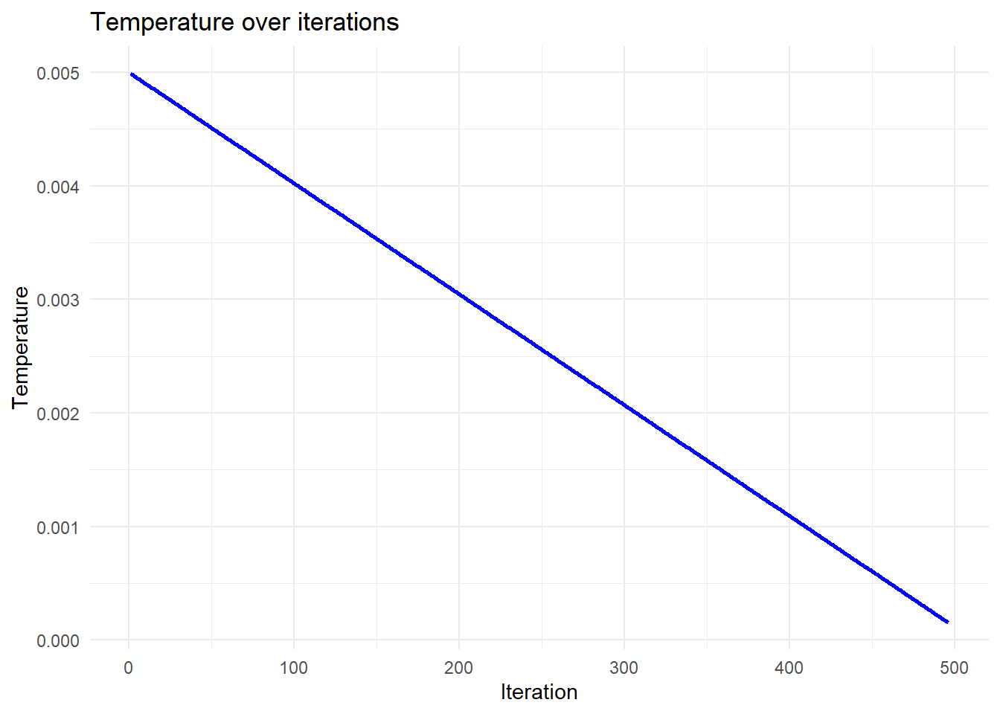
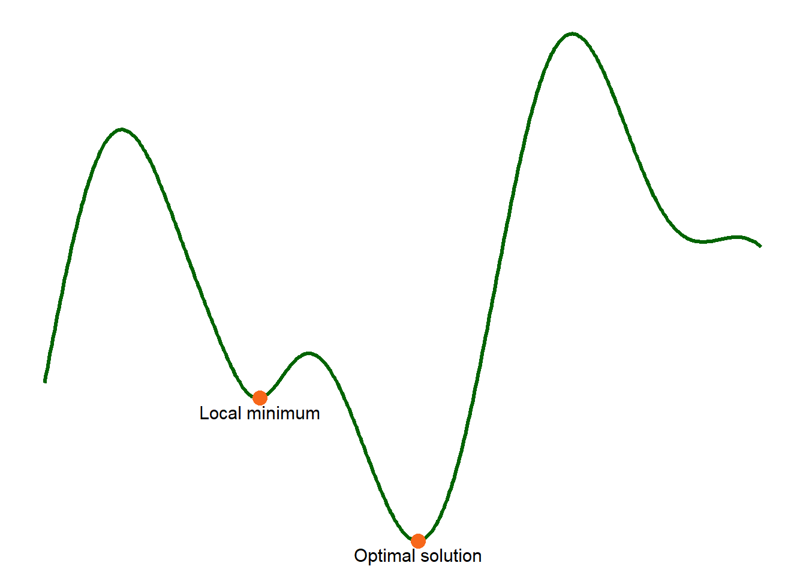
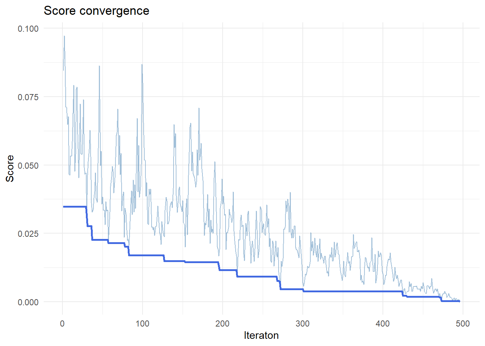
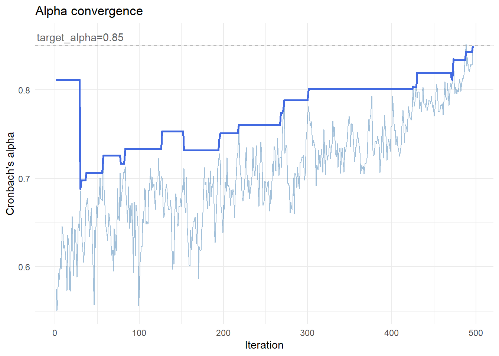

# makeItemsScale() explainer: Reconstructing Item-Level Data with a Target Cronbach’s Alpha

## Summary

Researchers often work with summated rating scales, where multiple items
are combined into a single score. In some situations, it is useful to
reverse this process: to generate item-level data that reproduce a given
scale while also exhibiting a desired level of internal consistency,
typically measured by Cronbach’s alpha.

This is not a straightforward task. Many different combinations of item
values can produce the same total score, but only a small subset will
yield the required reliability. The
[`makeItemsScale()`](https://winzarh.github.io/LikertMakeR/reference/makeItemsScale.md)
function addresses this problem by generating candidate datasets and
iteratively refining them to match a target alpha while preserving the
original scale values.

The approach combines a carefully designed scoring function with a
stochastic optimisation method known as *simulated annealing*. Together,
these allow the algorithm to explore a large space of possible solutions
and converge on datasets with realistic and controlled properties.

Show the code

``` r

## load required packages
library(dplyr)
library(ggplot2)
library(ggrepel)
library(gtools)
library(tidyr)
library(knitr)
library(kableExtra)
library(LikertMakeR)
```

### Quick example:

The short dataset in [Table 1](#tbl-opening_example) shows a four-item
5-point Likert scale, `myScale` for which we want to produce scale items
that match the scores in the dataset and have *Cronbach’s alpha* of
`0.80`. This result is achieved in the four columns, `V1 ... V4` which
average to equal the corresponding values in `myScale`.

Show the code

``` r

## set parameters
set.seed(42)

n <- 16

lower <- 1
upper <- 5
k <- 4
means <- runif(n = k, min = 2.25, max = 3.75)
sds <- runif(n = k, min = 0.7, max = 1.2)

target_alpha <- 0.8

## correlation matrix

r_mat <- makeCorrAlpha(items = k, alpha = target_alpha)

df <- makeScales(
  n = n, means = means, sds = sds, 
  lowerbound = lower, upperbound = upper, cormatrix = r_mat
  )
```

    Variable  1 :  item01  - 

    Variable  2 :  item02  - 

    Variable  3 :  item03  - 

    Variable  4 :  item04  - 


    Arranging data to match correlations

    Successfully generated correlated variables

Show the code

``` r

summated_scale <- rowSums(df)

myItems <- makeItemsScale(
  scale = summated_scale,
  lowerbound = lower,
  upperbound = upper,
  items = k,
  alpha = target_alpha,
  summated = TRUE,
  progress = FALSE
)

myAlpha <- alpha(, myItems) |> round(4)

all_dat <- cbind(df, myItems, summated_scale)

knitr::kable(all_dat)
```

| item01 | item02 | item03 | item04 |  X1 |  X2 |  X3 |  X4 | summated_scale |
|-------:|-------:|-------:|-------:|----:|----:|----:|----:|---------------:|
|      2 |      3 |      2 |      3 |   2 |   2 |   3 |   3 |             10 |
|      5 |      3 |      2 |      3 |   4 |   3 |   4 |   2 |             13 |
|      5 |      5 |      5 |      4 |   5 |   5 |   4 |   5 |             19 |
|      4 |      4 |      3 |      3 |   2 |   3 |   4 |   5 |             14 |
|      5 |      4 |      4 |      5 |   5 |   4 |   4 |   5 |             18 |
|      4 |      4 |      3 |      3 |   4 |   4 |   3 |   3 |             14 |
|      3 |      4 |      2 |      3 |   3 |   4 |   3 |   2 |             12 |
|      4 |      2 |      3 |      4 |   3 |   3 |   3 |   4 |             13 |
|      4 |      3 |      1 |      3 |   3 |   2 |   3 |   3 |             11 |
|      4 |      5 |      3 |      4 |   4 |   5 |   3 |   4 |             16 |
|      2 |      3 |      1 |      3 |   2 |   2 |   3 |   2 |              9 |
|      3 |      3 |      3 |      4 |   3 |   4 |   3 |   3 |             13 |
|      3 |      4 |      2 |      3 |   3 |   3 |   3 |   3 |             12 |
|      4 |      5 |      3 |      5 |   4 |   4 |   5 |   4 |             17 |
|      2 |      2 |      2 |      3 |   3 |   2 |   2 |   2 |              9 |
|      4 |      4 |      4 |      3 |   4 |   3 |   4 |   4 |             15 |

Table 1: Short Example: 4-item 5-point Likert scale, alpha = 0.8

Here, the resulting *Cronbach’s alpha* = 0.8032, so the synthetic data
are correct to two decimal places. Not bad for just 16 observations!
*(Actually, number of observations has little to do with **alpha**)*

Note also that the
[`makeItemsScale()`](https://winzarh.github.io/LikertMakeR/reference/makeItemsScale.md)
function does not exactly reproduce the original scale items. It simply
produces a plausible set of items that reproduce the same summated scale
along with the target Cronbach’s alpha.

## The Goal: Matching a Target Cronbach’s Alpha

Cronbach’s alpha is a widely used measure of internal consistency. It
reflects how closely related a set of items are as a group.

At a high level:

- High alpha → items behave similarly
- Low alpha → items behave more independently

The challenge that
[`makeItemsScale()`](https://winzarh.github.io/LikertMakeR/reference/makeItemsScale.md)
deals with is:

> Given a set of **row totals**, reconstruct item-level data such that:
>
> - Row sums are preserved
> - The resulting dataset has a desired alpha

These constraints make the problem non-trivial.

## From Scale to Items

Suppose we observe a total score of 12 for a respondent, using a 4-item
scale with values from 1 to 5.

There are many ways to construct such a row:

- $`[3, 3, 3, 3]`$
- $`[2, 3, 4, 3]`$
- $`[1, 5, 4, 2]`$

All satisfy the same row sum.

> The key insight: row sums alone do not determine item structure

The function begins by generating candidate combinations that satisfy
these constraints.

### The Core Challenge

Although many datasets satisfy the row sums, very few will produce the
desired Cronbach’s alpha.

This creates a large search problem:

- Many valid solutions
- Few desirable ones

To navigate this space, we need:

1.  A way to evaluate solutions
2.  A way to search efficiently

## The Score Function: What “Good” Looks Like

To guide the search, we define a score function:

``` math
score = alpha\_err^2 + w\_balance * balance\_penalty * (1 + alpha\_err)
```

where:

- $`alpha\_err = abs(calculated\_alpha - target\_alpha)`$
- $`balance\_penalty = mean((col\_means - expected\_mean)^2)`$
- $`w\_balance`$ is a relative weighting coefficient

Lower values for $`score`$ indicate better solutions.

$`balance\_penalty`$ measures how evenly the item means are distributed.

- Lower values indicate more similar item means
- Higher values indicate imbalance across items

### Component 1: Matching the target alpha

``` math
alpha\_err = abs(calculated\_alpha - target\_alpha)
```

- Measures deviation from the desired reliability
- Squared to penalise larger errors

### Component 2: Balancing item means

``` math
 balance\_penalty = mean((col\_means - expected\_mean)^2)
 
```

- Encourages similar item means
- Avoids unrealistic item distributions

### Competing objectives

These components may favour different solutions.



Figure 1: Score is the resolution of competing objectives

#### Interpreting the score function in [Figure 1](#fig-score_components)

- Alpha error is minimised at one point
- Balance penalty at another
- The final score is a compromise

The algorithm solves a **multi-objective optimisation problem**

In [Figure 1](#fig-score_components), the horizontal axis (“candidate
solution”) represents a range of possible datasets that the algorithm
might consider. Each point corresponds to a different arrangement of
item values, with varying levels of reliability and balance. The
vertical axis shows the penalty assigned by each component of the score
function.

The curves illustrate how different criteria favour different solutions.
The alpha error is lowest where the dataset is closest to the target
Cronbach’s alpha, while the balance penalty is lowest where item means
are most evenly distributed. These preferred solutions do not coincide.
The total score combines both components, producing a compromise that
reflects the relative weighting of each objective.

> In practice, the algorithm moves through many such candidate
> solutions, using the score to evaluate their quality and guide the
> search toward an optimal balance.

## Simulated Annealing: How We Search

Once we can evaluate solutions, we need a way to find good ones.

### The problem with greedy search

A simple strategy:

> Always accept improvements

A “greedy search” makes small changes and accepts every improvement,
rejecting any changes that do not improve the configuration. An earlier
version of the
[`makeItemsScale()`](https://winzarh.github.io/LikertMakeR/reference/makeItemsScale.md)
function did just this. It was fast, but often failed to converge to
give the desired alpha value because the algorithm was trapped in a
local minimum solution.

### The idea of simulated annealing

Simulated annealing allows occasional “worse” moves.

- Early: explore widely
- Later: refine carefully

#### Temperature

At each step, worse moves are accepted with probability:

``` math
P = exp ( \, - \frac {\Delta} {T} ) \,
```

where:

- $`\Delta`$ = how much worse the new solution is
- $`T`$ = temperature

#### What this means

##### High temperature

- $`T`$ is large
- $`\frac{\Delta} {T}`$ is small
- $`exp ( - \frac {\Delta}{T} ) \approx 1`$

Worse moves are often accepted

##### Low temperature

- $`T`$ is small
- $`\frac{\Delta} {T}`$ is large
- $`exp ( - \frac {\Delta}{T} ) \approx 0`$

Worse moves are almost never accepted

- High temperature → more exploration
- Low temperature → more selective

Temperature decreases over time:

#### Temperature “cools” over time

In this function, temperature starts at an initial value $`T_0`$, and
gradually decreases:

``` math
T = T_0 * (1 - iter / max\_iter)
```



Figure 2: Simulated Annealing temperature cooling over iterations

#### Visual intuition



Figure 3: Notional search space for optimisation algorithm

Think of a landscape as in [Figure 3](#fig-search_space):

- Valleys = good solutions
- Shallow valleys = local minima
- Deepest valley = optimal solution

A greedy search gets stuck.

Simulated annealing can escape and find better regions.

#### Types of Moves

The algorithm modifies rows while preserving row sums.

##### Redistribution

``` math
[3, 4, 2, 3] \rightarrow [4, 3, 2, 3]
```

- One value increases
- Another decreases

##### Swap

``` math
[3, 4, 2, 3] \rightarrow [3, 2, 4, 3]
```

- Values exchanged
- No change in distribution

##### Key constraint

> Row sums are always preserved

This ensures consistency with the input scale.

#### How It All Works Together

At each iteration:

1.  Propose a change
2.  Compute the score
3.  Accept or reject based on temperature

> The score defines the landscape; simulated annealing explores it.

### What the Algorithm Looks Like in Practice

We can track the algorithm over time.

#### Temperature

- Decreases steadily
- Controls exploration

#### Score



Figure 4: Simulated Annealing Score over iterations

As we see in [Figure 4](#fig-score_trace):

- Noisy early
- Stabilises over time

The lighter line shows the current value for `score` at each iteration.
The heavy line shows the best value achieved so far, improving steadily
over time.

Early iterations have wide variation, reflecting exploration with high
temperature. Later iterations have lower temperature and reduced
variation.

#### Alpha

[Figure 5](#fig-alpha_trace) shows that over time, alpha:

- Fluctuates early
- Converges toward target

##### Convergence Toward Target Alpha



Figure 5: Simulated Annealing Cronbach’s alpha over iterations

The lighter line shows the current alpha, which fluctuates as the
algorithm explores different configurations. The darker line tracks the
best solution found so far, improving steadily over time.

Early iterations are volatile, reflecting exploration. Later iterations
stabilise as the algorithm refines the solution.

> This transition from exploration to refinement is the defining feature
> of simulated annealing.

#### Extensions

The score function can be extended to include:

- variance constraints
- distribution shape
- additional structural properties

However:

> More constraints make optimisation harder

### Summary

- The problem is to reconstruct item-level data from scale totals
- The score function defines what “good” means
- Simulated annealing enables effective search
- The result is a flexible, realistic dataset with controlled
  reliability
