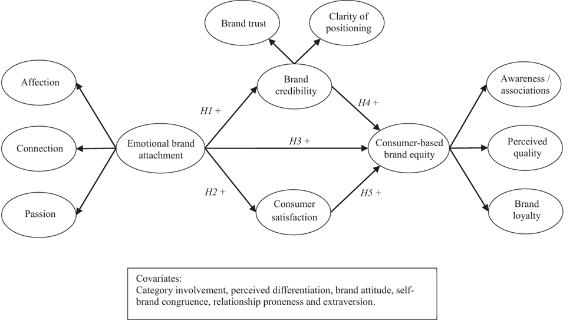

<!-- page 1 -->

<!--  -->

<!-- page 2 -->

```{r}
#| label: "setup"
#| echo: false
#| message: false
#| warning: false

library(knitr)
library(kableExtra)
library(matrixcalc)
library(dplyr)
library(stringr)
library(lavaan)
```


# tl;dr {.unnumbered}

  * **Goal:** Demonstrate how the **LikertMakeR** package [@winzar2026] can reconstruct survey data using only published summary statistics.
  * **Source study:** @dwivedi2019 reports results from a 43-item survey of 340 respondents measuring 15 constructs.
  * **Method:**

    - Generate synthetic scale scores with the same means and standard deviations as the published data.
    - Apply the reported correlation matrix to reproduce the relationships among variables.
    - Reconstruct plausible individual survey items using reported reliability (Cronbach’s $\alpha$).
    
* **Validation:** The synthetic dataset closely reproduces the published descriptive statistics, correlations, and scale reliabilities.
* **Result:** Structural equation modelling of the synthetic data produces relationships consistent with those reported in the original paper.
* **Takeaway:** _LikertMakeR_ can approximate realistic datasets from published results, enabling replication exercises, teaching examples, and methodological exploration when raw data are unavailable.


# Dwivedi et al. (2019) data replication {.unnumbered}


##  Background {.unnumbered}

Researchers often publish **summary statistics** - means, standard deviations, correlations, and reliability estimates - without releasing the original data.

In teaching, simulation studies, and methodological work, it can be useful to **reconstruct plausible datasets** from those published summaries.


::: {.callout-important}

## Prerequisites {.unnumbered}

This tutorial assumes a basic familiarity with:

 - Likert-scale survey data
 - correlation matrices
 - structural equation modelling

Required R packages:

 - `library(LikertMakeR)`
 - `library(lavaan)`
:::


The **_LikertMakeR_** package provides tools for doing exactly this: 
generating synthetic Likert-scale datasets that reproduce the statistical 
properties of reported data.


In this tutorial we demonstrate the process using a published study 
by @dwivedi2019. 
Using only the statistics reported in their paper, we reconstruct a 
synthetic dataset and show that it reproduces the 
key statistical relationships reported in the original analysis. 

@dwivedi2019 sought to understand social media platforms from a “brand” 
perspective through examining the effect of consumers’ emotional attachment on 
social media consumer-based brand equity (CBBE) using an online survey of 
340 Australian social media consumers, as shown in @fig-model.


::: {#fig-model fig-cap="Hypothesised relationships among variables. (*Dwivedi et al. (2019))*"}

{
  fig-align="center"
  fig-cap-location="margin"
}

:::


## Overview of the Reconstruction Process {.unnumbered}

Reconstructing a dataset from published statistics involves several steps:

 1. Extract summary statistics from the published paper
 1. Reconstruct scale-level distributions (means and standard deviations)
 1. Reconstruct the correlation structure between scales
 1. Generate synthetic Likert-scale item responses consistent with those statistics
 1. Verify that the reconstructed dataset reproduces the reported results

We now walk through each step.

### Verifying the Reconstruction {.unnumbered}

Reconstructing data from summary statistics inevitably involves approximation.

To assess whether the reconstruction is credible, we compare several properties of the synthetic dataset with those reported in the original paper:

 - scale means and standard deviations
 - inter-scale correlations
 - reliability estimates
 - structural equation model results

If these statistics closely match the published values, the synthetic data 
can be considered a reasonable reconstruction of the original dataset.


# Step 1: Extract summary statistics

To recreate a plausible dataset, we need to match the first two statistical moments of each scale:

 - the **mean** (average level of responses), and
 - the **standard deviation** (spread of responses).

If synthetic data reproduce these two properties, the reconstructed scales behave similarly to the original ones.

Fifteen constructs were measured with Likert scales constructed from 43 items (questions). Summary statistics from the study are shown in @tbl-moments.


```{r}
#| label: "extract_moments"
#| echo: false

moments <- read.csv(file = "data/moments.csv", header = TRUE)
```


```{r}
#| label: tbl-moments
#| tbl-cap: Summary statistics and variable properties. (*Dwivedi et al. (2019))*
#| tbl-cap-location: "margin"
#| echo: FALSE

kbl(moments) |>
  kable_styling(full_width = FALSE, latex_options = "scale_down")
```


# Step 2:  Reconstruct scale distributions

With those summary statistics, we can synthesise a dataframe with the 
same first and second moments as the original, 
using the `LikertMakeR::lfast()` function.


```{r}
#| label: base_data
#| echo: TRUE
#| warning: FALSE
#| message: TRUE

library(LikertMakeR)

sample_size <- 340
lower <- 1
upper <- 5

set.seed(42)

base_data <- data.frame(
  AFF = lfast(sample_size, mean = 2.51, sd = 0.93, lower, upper, items = 2),
  CON = lfast(sample_size, mean = 2.79, sd = 0.98, lower, upper, items = 2),
  PAS = lfast(sample_size, mean = 2.62, sd = 0.89, lower, upper, items = 3),
  COP = lfast(sample_size, mean = 3.52, sd = 0.70, lower, upper, items = 3),
  TRT = lfast(sample_size, mean = 3.30, sd = 0.74, lower, upper, items = 4),
  SAT = lfast(sample_size, mean = 3.87, sd = 0.64, lower, upper, items = 3),
  AWR = lfast(sample_size, mean = 4.10, sd = 0.62, lower, upper, items = 5),
  QUL = lfast(sample_size, mean = 3.69, sd = 0.66, lower, upper, items = 4),
  LOY = lfast(sample_size, mean = 3.56, sd = 0.84, lower, upper, items = 2),
  DIF = lfast(sample_size, mean = 3.80, sd = 0.78, lower, upper, items = 2),
  FIT = lfast(sample_size, mean = 3.02, sd = 0.83, lower, upper, items = 2),
  EXT = lfast(sample_size, mean = 3.09, sd = 0.91, lower, upper, items = 2),
  ATT = lfast(sample_size, mean = 3.50, sd = 0.81, lower, upper, items = 2),
  REL = lfast(sample_size, mean = 2.90, sd = 0.83, lower, upper, items = 3),
  INV = lfast(sample_size, mean = 3.32, sd = 0.92, lower, upper, items = 4)
)
```


With this base dataframe, we check the summary statistics and find 
in @tbl-base_data that the means and standard deviations are the 
same as in the reported data, to two decimal places.


```{r}
#| label: tbl-base_data
#| tbl-cap: Synthetic data summary statistics
#| tbl-cap-location: "margin"
#| echo: false

base_means <- sapply(base_data, mean)
base_sd <- sapply(base_data, sd)

base_moments <- data.frame(
  mean = base_means |> round(3),
  sd = base_sd |> round(3)
)

kbl(base_moments) |>
  kable_styling(full_width = FALSE, latex_options = "scale_down")
```


# Step 3: Correlations to match published data

These existing synthetic data have random low correlations. 
We need to correlate the variables according to the reported data.
@dwivedi2019 reported the correlation presented in 
 @tbl-show_target_correlations. 
 This is our target correlation matrix.
 

```{r}
#| label: make_target_correlations
#| echo: FALSE

dwivedi_correlations <- read.csv("data/correlations.csv", header = FALSE) |>
  as.matrix()

varnames <- colnames(base_data)
dimnames(dwivedi_correlations) <- list(Rows = varnames, Cols = varnames)
```


```{r}
#| label: tbl-show_target_correlations
#| tbl-cap: Target correlation matrix. *Dwivedi et al. (2019)*
#| tbl-cap-location: "margin"
#| echo: false

kbl(dwivedi_correlations) |>
  kable_styling(full_width = FALSE, latex_options = "scale_down")
```


We apply this correlation matrix to our existing data so that the 
variables are correlated according to our target correlations, 
using the `LikertMakeR::lcor()` function.


```{r}
#| label: correlate_base
#| echo: true

correlated_data <- LikertMakeR::lcor(
  data = base_data,
  target = dwivedi_correlations
)
names(correlated_data) <- varnames
```


And the revised dataframe should be correlated in the same way as the 
published data. Results are shown in @tbl-synth_correlations. 


```{r}
#| label: calc-synth_correlations
#| echo: TRUE

synth_correlations <- cor(correlated_data)
dimnames(synth_correlations) <- list(Rows = varnames, Cols = varnames)
```


```{r}
#| label: tbl-synth_correlations
#| tbl-cap: Synthetic data correlation matrix.
#| tbl-cap-location: "margin"
#| echo: false

kbl(synth_correlations |> round(2)) |>
  kable_styling(full_width = FALSE, latex_options = "scale_down")
```


The synthetic data correlations appear to be the same, rounded to two decimal 
places, as the target, published correlations. 

To quantify how closely the reconstructed correlations match the published ones, we compute the **Frobenius norm** of the difference between the two matrices.

In simple terms, this measures the overall discrepancy between the 
two correlation tables. 
A value close to zero indicates that the reconstructed correlations 
closely match those reported in the paper.

The _Frobenius Norm_  is defined as the square root of the sum of the squares 
of all the matrix entries @eq-frobenius. 


::: {.column-margin}

$$
F = \left( \sum_{i=1}^m \sum_{j=1}^n a_{ij}^2 \right)^{1/2}
$$ {#eq-frobenius}

*Frobenius norm of a matrix.*

:::


```{r}
#| label: frobenius_norm
#| echo: TRUE
#| message: false

mat_diff <- dwivedi_correlations - synth_correlations
frob_diff <- matrixcalc::frobenius.norm(mat_diff)
```


Calculated _Frobenius Norm_ here is `r frob_diff`, which is very low 
for a matrix of this size.


# Step 4: Generate synthetic Likert responses

So far we have reconstructed the statistical properties of the scales.
The next step is to generate individual Likert item responses consistent 
with those statistics.

Given the correlated variables, we also have information on the nature 
of the items that make each variable presented in @tbl-moments. 
We can use those reliability coefficients to generate plausible individual item responses.

We use the `LikertMakeR::makeItemsScale()` function.


```{r}
#| label: make_first_items
#| message: FALSE
#| echo: true

set.seed(42)

aff_items <- makeItemsScale(
  scale = correlated_data$AFF,
  lowerbound = 1, upperbound = 5, 
  items = 2,
  alpha = 0.87, 
  summated = FALSE, 
  progress = FALSE
)
names(aff_items) <- c("aff1", "aff2")
```


Generating the other 14 sets of scale items works the same way, using alpha values and number of item from @tbl-moments.


```{r}
#| label: make_more_items
#| message: false
#| echo: TRUE

con_items <- makeItemsScale(correlated_data$CON, 1, 5, 2, 0.87, FALSE, FALSE)
names(con_items) <- c("con1", "con2")

pas_items <- makeItemsScale(correlated_data$PAS, 1, 5, 3, 0.84, FALSE, FALSE)
names(pas_items) <- c("pas1", "pas2", "pas3")

cop_items <- makeItemsScale(correlated_data$COP, 1, 5, 3, 0.80, FALSE, FALSE)
names(cop_items) <- c("cop1", "cop2", "cop3")

trt_items <- makeItemsScale(correlated_data$TRT, 1, 5, 4, 0.88, FALSE, FALSE)
names(trt_items) <- c("trt1", "trt2", "trt3", "trt4")

sat_items <- makeItemsScale(correlated_data$SAT, 1, 5, 3, 0.86, FALSE, FALSE)
names(sat_items) <- c("sat1", "sat2", "sat3")

awr_items <- makeItemsScale(correlated_data$AWR, 1, 5, 5, 0.87, FALSE, FALSE)
names(awr_items) <- c("awr1", "awr2", "awr3", "awr4", "awr5")

qul_items <- makeItemsScale(correlated_data$QUL, 1, 5, 4, 0.84, FALSE, FALSE)
names(qul_items) <- c("qul1", "qul2", "qul3", "qul4")

loy_items <- makeItemsScale(correlated_data$LOY, 1, 5, 2, 0.79, FALSE, FALSE)
names(loy_items) <- c("loy1", "loy2")

dif_items <- makeItemsScale(correlated_data$DIF, 1, 5, 2, 0.85, FALSE, FALSE)
names(dif_items) <- c("dif1", "dif2")

fit_items <- makeItemsScale(correlated_data$FIT, 1, 5, 2, 0.82, FALSE, FALSE)
names(fit_items) <- c("fit1", "fit2")

ext_items <- makeItemsScale(correlated_data$EXT, 1, 5, 2, 0.79, FALSE, FALSE)
names(ext_items) <- c("ext1", "ext2")

att_items <- makeItemsScale(correlated_data$ATT, 1, 5, 2, 0.88, FALSE, FALSE)
names(att_items) <- c("att1", "att2")

rel_items <- makeItemsScale(correlated_data$REL, 1, 5, 3, 0.79, FALSE, FALSE)
names(rel_items) <- c("rel1", "rel2", "rel3")

inv_items <- makeItemsScale(correlated_data$INV, 1, 5, 4, 0.79, FALSE, FALSE)
names(inv_items) <- c("inv1", "inv2", "inv3", "inv4")
```


The first ten observations are presented in @tbl-all_items. 
They are all integer responses to standard 1-5 Likert-scale-item questions.


```{r}
#| label: tbl-all_items
#| echo: false
#| tbl-cap: First ten rows of our synthetic data - all 43 items
#| tbl-cap-location: "margin"

all_items <- cbind(aff_items, con_items, pas_items, cop_items, trt_items, sat_items, awr_items, qul_items, loy_items, dif_items, fit_items, ext_items, att_items, rel_items, inv_items)

# show first ten observations
head(all_items, 10)
```


The resulting dataset contains simulated item responses that follow the same statistical structure as the original study. Most constructs achieved Cronbach's alpha values close to those specified, as we can see in @tbl-compare_alphas. 


```{r}
#| label: tbl-compare_alphas
#| tbl-cap: Comparison between Cronbach's alphas for original published constructs and synthetic constructs.
#| tbl-cap-location: "margin"
#| echo: false
# extract the data
original_alphas <- moments$alpha

# apply `LikertMakeR::alpha()` to calculate Cronbach's alpha
alphas <- c(
  alpha(data = aff_items),
  alpha(data = con_items),
  alpha(data = pas_items),
  alpha(data = cop_items),
  alpha(data = trt_items),
  alpha(data = sat_items),
  alpha(data = awr_items),
  alpha(data = qul_items),
  alpha(data = loy_items),
  alpha(data = dif_items),
  alpha(data = fit_items),
  alpha(data = ext_items),
  alpha(data = att_items),
  alpha(data = rel_items),
  alpha(data = inv_items)
)

# bring them together
compared_alphas <- data.frame(
  construct = varnames,
  original_alphas = original_alphas,
  synthetic_alphas = alphas |> round(3)
)

kbl(compared_alphas) |>
  kable_styling(full_width = FALSE, latex_options = "scale_down")
```


# Step 5: Reproduce relationship structure analysis

## Structural Equation Model

Now that we have a complete synthetic data set, we can analyse the data to see if we can find the same relationships found by _Dwivedi et al._

## original results

The original published results from _Dwivedi et al._ are reproduced in @tbl-table_4.


```{r}
#| label: tbl-table_4
#| tbl-cap: Parameter estimates of the hypothesised and alternative models - Table IV from  _Dwivedi et al. (2019)_.
#| tbl-cap-location: "margin"
#| echo: FALSE


original_betas <- read.csv("data/table_4.csv", header = TRUE)

original_betas <- original_betas |>
  mutate(
    Estimated_path = gsub("->", "\u2192", Estimated_path)
  )

panel_a <- original_betas[c(2:6, 8, 10:11), ]
row.names(panel_a) <- NULL

panel_b <- original_betas[c(13:17, 19), ]
row.names(panel_b) <- NULL

combined <- bind_rows(panel_a, panel_b)

kbl(
  combined,
  col.names = c(
    "Estimated path",
    "\u03B2",
    "95% CI",
    "Hypothesis support"
  ),
  booktabs = TRUE,
  align = c("l", "r", "c", "c")
) |>
  pack_rows("Panel A: Hypothesised model results", 1, 5) |>
  pack_rows("Total indirect effect", 6, 6, italic = TRUE) |>
  pack_rows("Specific indirect effects", 7, 8, italic = TRUE) |>
  pack_rows("Panel B: Alternative model results", 9, 13) |>
  pack_rows("Specific indirect effects", 14, 14, italic = TRUE) |>
  kable_styling(
    full_width = FALSE,
    position = "center",
    latex_options = "scale_down"
  )
```


## Results from synthetic data

The authors of the original paper used the _AMOS_ program, which is a 
part of **_SPSS_**. 
I&nbsp;haven't used _SPSS/AMOS_ for a very long time, so I'll run my analysis 
using the `lavaan` package for **_R_**. By default, _AMOS_ uses 
Maximum Likelihood (ML) estimation, while _lavaan_ uses Robust Maximum 
Likelihood (MLR). With ML specified and bootstrapped confidence interval 
estimates, we _should_ get comparable output. 


```{r}
#| label: sem_analysis
#| warning: FALSE
#| message: true
#| eval: TRUE

# model definition
model <- "
# first-order constructs
    AFF =~ aff1 + aff2
    CON =~ con1 + con2
    PAS =~ pas1 + pas2 + pas3
    AWR =~ awr1 + awr2 + awr3 + awr4 + awr5
    QUL =~ qul1 + qul2 + qul3 + qul4
    LOY =~ loy1 + loy2
    COP =~ cop1 + cop2 + cop3
    TRT =~ trt1 + trt2 + trt3 + trt4
    SAT =~ sat1 + sat2 + sat3
# second-order constructs
    Attachment =~  AFF + CON + PAS
    Credibility =~ TRT + COP
    BrandEquity =~ AWR + QUL + LOY
# structural model
    Credibility ~ H1*Attachment
    SAT ~ H2*Attachment
    BrandEquity ~ H3*Attachment + H4*Credibility + H5*SAT
# allow correlation between mediators
   Credibility ~~ SAT
# Specific indirect effects
  ind_Attachment_via_Credibility := H1 * H4
  ind_Attachment_via_SAT := H2 * H5
# Total indirect effect
  total_ind_Attachment := (H1 * H4) + (H2 * H5)
# Total effect
  total_Attachment := H3 + total_ind_Attachment
"

set.seed(42)

# run the model
sem_result <- lavaan::sem(
  model,
  data = all_items,
  estimator = "ML" ,
  se = "bootstrap",
  bootstrap = 2000
)

# extract standardised results
std_results <- lavaan::standardizedSolution(sem_result)
# Keep only structural and indirect effects
std_structural <- std_results[
  std_results$op %in% c("~", ":="),
]
# Keep only regressions (~) and defined parameters (:=)
std_results <- std_results[std_results$op %in% c("~", ":="), ]
# Get bootstrap CI from parameterEstimates
boot_pe <- lavaan::parameterEstimates(
  sem_result,
  standardized = TRUE,
  ci = TRUE,
  boot.ci.type = "bca.simple"
)
boot_pe <- boot_pe[boot_pe$op == ":=", ]
```


In this paper, we confine ourselves to the main theoretical model shown 
in _Panel A_. 
Parameter estimates of the hypothesised model are summarised 
in @tbl-sem_summary. We can see that not all the figures are exactly 
the same as in the original, but they are very close and the conclusions 
are the same.  


```{r}
#| label: tbl-sem_summary
#| tbl-cap: Parameter estimates of the hypothesised model - From synthetic data.
#| tbl-cap-location: "margin"
#| echo: FALSE

med_table <- std_results |>
  left_join(
    boot_pe |>
      select(lhs, op, rhs,
        ci.lower_boot = ci.lower,
        ci.upper_boot = ci.upper
      ),
    by = c("lhs", "op", "rhs")
  )

med_table_clean <- med_table |>
  mutate(
    Estimated_path = case_when(
      op == "~" ~ paste(rhs, "\u2192", lhs),
      op == ":=" ~ lhs
    ),
    beta = round(est.std, 2),
    CI = paste0(
      "[",
      round(ci.lower, 2),
      ", ",
      round(ci.upper, 2),
      "]"
    )
  ) |>
  select(Estimated_path, beta, CI)

## Separate Direct and Indirect Sections

direct_rows <- med_table_clean |>
  filter(!str_detect(Estimated_path, "ind_|total_"))

indirect_rows <- med_table_clean |>
  filter(str_detect(Estimated_path, "ind_|total_"))

combined <- bind_rows(direct_rows, indirect_rows)

kbl(
  combined,
  col.names = c("Estimated path", "\u03B2", "95% CI"),
  booktabs = TRUE,
  align = c("l", "r", "c")
) |>
  pack_rows("Direct effects", 1, nrow(direct_rows)) |>
  pack_rows(
    "Indirect and total effects",
    nrow(direct_rows) + 1,
    nrow(combined)
  ) |>
  kable_styling(full_width = FALSE, latex_options = "scale_down")
```


A graphic representation of the structural component of the SEM model 
created by the synthetic data is presented in @fig-synthetic_model. 


```{r}
#| label: fig-synthetic_model
#| fig-cap: Structural model of Synthetic data - reproducing original data.
#| fig-cap-location: "margin"
#| echo: false

# load("sem_result.Rda")

semptools::quick_parallel_mediation(
  sem_result,
  x = c("Attachment"),
  y = c("BrandEquity"),
  m = c("Credibility", "SAT"),
  whatLabels = "stand",
  nCharNodes = 14,
  sizeLat = 10,
  edge.label.cex = 0.8,
  do_add_rsq = 1
)
```


# Conclusion

This exercise set out to see if we can use functions in the _LikertMakeR_ 
package to "reproduce" raw data based on summary statistics presented in a 
published report. We find that results are surprisingly strong - producing 
data that give similar output to those in the original report, and giving 
the same conclusions. 
Of course we cannot expect the data to give exactly the same 
results - after all, they are artificial and subject to rounding 
of the reported output.


## What we have learned

This reconstruction demonstrates that synthetic Likert-scale data can be generated from published summary statistics with high fidelity.

Even though the original raw data are unavailable, the reconstructed dataset reproduces:

 - the reported scale distributions
 - the correlation structure between constructs
 - the reliability estimates
 - the results of the structural equation model

This makes synthetic reconstruction useful for:

 - teaching statistical methods
 - replicating published analyses
 - conducting methodological simulations when raw data are unavailable.

----


# References


